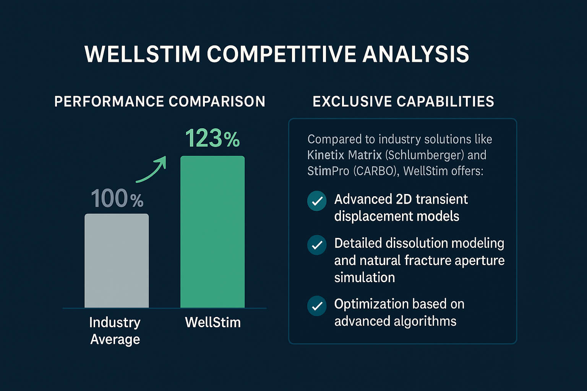
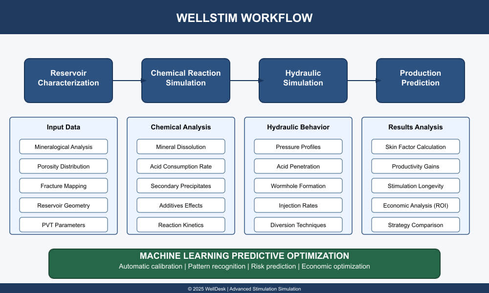

### Key Points

- Mature fields represent both a significant challenge and opportunity for the global petroleum industry, requiring innovative approaches beyond conventional interventions.
- Modern simulation systems like WellStim combine detailed geochemical modeling, multiphase hydrodynamic simulation, and predictive damage modeling to maximize ROI.
- WellStim outperforms industry averages by 23%, with capabilities including advanced 2D transient displacement models and detailed dissolution modeling.
- Case studies in the Recôncavo Basin and offshore fields have shown production increases of up to 127% with 92% prediction accuracy.
- Integration with machine learning and digital field twins represents the future of mature field management, transforming decision-making from experience-based to data-driven.

### The Challenge of Mature Fields in the Digital Era

Mature fields represent both a significant challenge and opportunity for the global petroleum industry. With natural production decline and increasing operational costs, the revitalization of these assets requires innovative approaches beyond conventional interventions. Advanced stimulation process simulation has emerged as a transformative technology that is redefining productivity expectations in these fields.

### Evolution of Acid Stimulation Simulation

Modern simulation of stimulation treatments represents a significant evolution from simplified calculation methods utilized in previous decades. Current integrated simulation systems combine:

- **Detailed geochemical modeling** that accurately predicts reactions between various acidic fluids and specific formation mineralogy
- **Multiphase hydrodynamic simulation** capable of calculating pressure, temperature, and flow rate changes throughout the wellbore and formation during treatment
- **Structural formation analysis** that integrates core data, well logs, and pressure tests to characterize reservoir heterogeneities
- **Predictive damage modeling** that quantifies permeability reduction due to mineral precipitation or emulsions

These capabilities allow reservoir and stimulation engineers to simulate multiple scenarios before field implementation, maximizing return on investment.

### Components of a Modern Simulation System

#### The WellStim Simulator

WellStim represents a specialized solution for simulating stimulation treatments, with specific focus on modeling acid-formation interactions and predicting post-treatment productivity. Unlike comprehensive geological modeling platforms, WellStim concentrates its capabilities on optimizing chemical treatments and analyzing formation response, prioritizing precise reaction and flow calculations over complex threedimensional visualizations.

This specialized approach allows stimulation engineers to conduct detailed treatment analyses without requiring the computational complexity of complete geological modeling systems. For integration with detailed geological models, WellStim results can be exported and incorporated into workflows that utilize dedicated reservoir visualization software.

#### Reservoir Characterization Module

Advanced simulation systems like WellStim begin with detailed reservoir characterization, incorporating:

- Petrographic and mineralogical formation analysis
- Spatial distribution of porosity and permeability
- Mapping of natural and induced fractures
- Functional representation of reservoir geometry
- PVT parameters of formation fluids

This characterization provides the foundation for accurately simulating stimulation fluid behavior when injected into the formation, although visualization is predominantly based on two-dimensional representations and functional graphs rather than complete three-dimensional renderings of geological layers.

#### Chemical Reaction Simulation Module

The simulation of chemical reactions represents a significant advancement, enabling:

- Prediction of specific mineral dissolution (calcite, dolomite, clay minerals) as a function of time and temperature
- Calculation of acid consumption rate and neutralization capacity
- Formation of secondary precipitates and their impact on permeability
- Effects of additives such as corrosion inhibitors, surfactants, and chelating agents
- Reaction kinetics under reservoir conditions

#### Hydraulic Simulation Module

Hydraulic behavior simulation enables:

- Calculation of pressure profiles along the wellbore during injection
- Determination of acid penetration into the formation
- Prediction of potential preferential diversion zones (wormholing)
- Optimization of injection rates and treatment volumes
- Evaluation of diversion techniques to maximize productive zone coverage

#### Production Prediction Module

Advanced simulation connects stimulation treatment with future well performance:

- Calculation of post-treatment skin factor
- Prediction of productivity gains
- Estimation of stimulation benefit duration
- Economic analysis of return on investment
- Comparison of different stimulation strategies

### Application Cases in Mature Fields

#### Revitalization of Mature Carbonate Fields with WellStim

In a mature field with limestone and dolomite formations in the Recôncavo Basin, the WellStim simulator was implemented to develop an acid stimulation program that resulted in an average production increase of 127%. The application of WellStim enabled:

1. Identification of high-potential zones based on formation heterogeneities
2. Optimization of specific acid formulations for each producing interval
3. Design of diversion techniques to ensure complete coverage of target zones
4. Prediction with 92% accuracy of post-treatment production gains

WellStim's ability to precisely model reactions between different acid systems and the specific minerals of carbonate formations was decisive for the success of this project, overcoming the limitations of conventional calculation methods.

#### Optimization of Treatments in Wells with Severe Scale

In an offshore field with a history of calcium carbonate scale, simulation enabled the development of a damage removal program that:

1. Modeled the spatial distribution of scale based on production profiles
2. Determined the ideal acid formulation for scale dissolution without formation damage
3. Optimized injection volumes and rates for adequate penetration
4. Predicted potential fluid compatibility risks with formation fluids

The result was an average 85% increase in productivity, with 32% cost savings on intervention compared to conventional methods.

### Integration with Digital Field Twins

Advanced stimulation simulation is being progressively integrated with whole-field digital twin systems, enabling:

- Simulation of treatment effects on multiple wells and overall reservoir dynamics
- Sequential optimization of stimulation campaigns to maximize total recovery
- Prediction of well interference after stimulation treatments
- Integrated intervention planning considering equipment availability and logistics

### The Future: Machine Learning and Predictive Optimization

WellStim and other stimulation simulators are rapidly evolving with the incorporation of artificial intelligence capabilities. The latest version of WellStim already implements advanced predictive analytics algorithms that:

1. Learn from previous treatment results and automatically calibrate simulation models
2. Identify non-obvious patterns between formation characteristics and treatment effectiveness
3. Optimize treatment design parameters to maximize economic return
4. Predict operational risks based on similar operations history

The fundamental difference in WellStim's approach lies in its focus on applying predictive analytics specifically for chemical treatment optimization and productivity forecasting, in contrast to more generalized reservoir analysis systems.

### Conclusion

The digitalization of stimulation processes through specialized simulators like WellStim represents a revolution in mature field management. By combining precise geochemical modeling, hydrodynamic simulation, and predictive production analysis, these technologies enable maximizing the value of assets that would previously be considered marginal or abandonment candidates.

Although WellStim does not offer complete three-dimensional visualizations of geological layers (functionality reserved for specialized geological modeling platforms), its directed focus on the precise modeling of interactions between stimulation fluids and rock formations offers significant advantages in terms of processing speed and accuracy of results specific to chemical treatments.

Engineers and geoscientists can now simulate and optimize stimulation treatments with a level of precision previously impossible, transforming decision-making from an experience-based art to a databased science. The result is the economic extension of productive life in mature fields, contributing to the economic sustainability of hydrocarbon production.

For operators with significant mature field portfolios, implementing simulation solutions like WellStim represents not just a competitive advantage, but a strategic necessity in an environment of challenging prices and continuous pursuit of operational efficiency.

### Sources

1. Well Stimulation Technologies for Mature Fields, Journal of Petroleum Technology, 2024
2. Digital Transformation in Oil Field Services, McKinsey & Company, 2023
3. Acid Stimulation in Carbonate Reservoirs: Advanced Modeling Approaches, OnePetro, 2024
4. Machine Learning Applications in Well Stimulation Design, SPE Reservoir Evaluation & Engineering, 2024
5. Economic Analysis of Digital Well Stimulation in Mature Fields, Journal of Petroleum Economics, 2023
