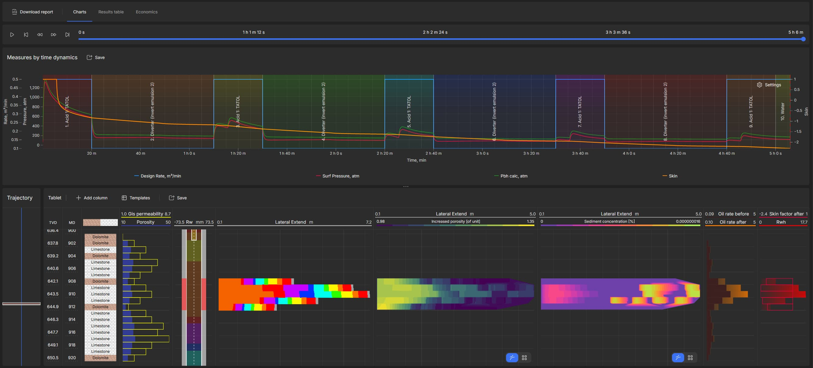
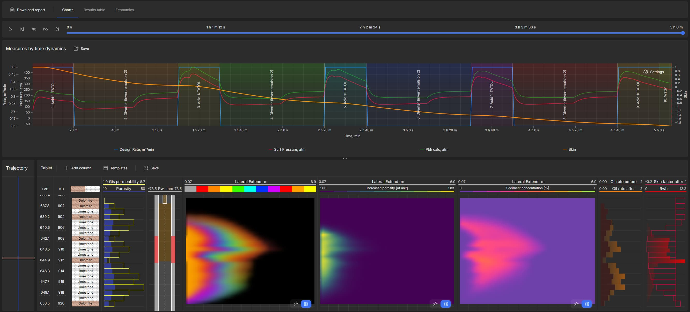
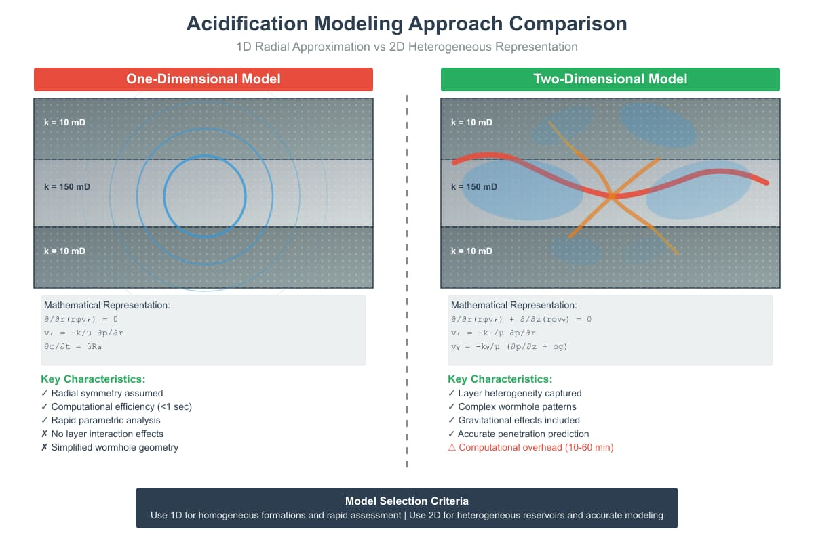

## Abstract

This paper presents a comprehensive comparative analysis of one-dimensional (1D) and two-dimensional (2D) models used in the simulation of oil well acidification processes. Acidification is a crucial stimulation technique for increasing the productivity of carbonate and sandstone reservoirs. We analyze the mathematical foundations, physicochemical considerations, limitations, and relative benefits of each modeling approach. Results demonstrate that while 1D models offer computational simplicity and rapid results, 2D models provide a more realistic representation of flow patterns and rock matrix dissolution, especially in heterogeneous formations. The choice between methodologies should be based on the specific objectives of the operation, the geological characteristics of the reservoir, and the available computational resources. This study contributes to the optimization of well acidification processes and the development of more efficient strategies in hydrocarbon reservoir management.

**Keywords:** Well acidification; Numerical modeling; 1D simulation; 2D simulation; Reservoir engineering

## 1. Introduction

Well acidification is a stimulation technique widely used in the petroleum industry to increase reservoir productivity, particularly in carbonate and sandstone formations. The process involves injecting acidic solutions into the reservoir to dissolve rock material, create preferential flow channels (wormholes), and increase formation permeability near the well (Economides & Nolte, 2000).

Mathematical modeling and computational simulation of these processes are essential tools for optimizing acid treatment designs, predicting their results, and minimizing operational risks. However, the complexity of the physicochemical phenomena involved, including heterogeneous reactions, mass transport, and alterations in porous media geometry, represents a significant challenge for reservoir engineers.

Modeling approaches vary in complexity, from one-dimensional (1D) models to complete three-dimensional (3D) models. 1D models represent the simplest approximation, focusing primarily on radial mass transport and chemical reactions along a single spatial dimension. On the other hand, 2D models incorporate additional heterogeneities and two-dimensional effects, allowing a more realistic representation of wormhole formation and fluid-rock interactions.

This paper presents a detailed comparative analysis between 1D and 2D modeling approaches for acidification process simulation, evaluating their theoretical bases, numerical implementations, limitations, and applicability to different field scenarios.

## 2. Theoretical Foundations of Well Acidification

### 2.1 Basic Principles

Well acidification is based on the reaction between an acid and the constituent minerals of the reservoir rock. In carbonate formations, composed mainly of calcite (CaCO₃) and dolomite (CaMg(CO₃)₂), hydrochloric acid (HCl) is commonly used, according to the following reactions:

For calcite:

$$
{CaCO₃ + 2HCl → CaCl₂ + H₂O + CO₂}
$$

For dolomite:

$$
{CaMg(CO₃)₂ + 4HCl → CaCl₂ + MgCl₂ + 2H₂O + 2CO₂}
$$

In sandstone formations, composed mainly of quartz (SiO₂) and clay minerals, hydrofluoric acid (HF) or mixtures of HCl and HF, known as "mud acid," are typically used (Schechter, 1992).

### 2.2 Dissolution Regimes

The effectiveness of acid treatment strongly depends on the predominant dissolution regime, which is controlled by the competition between the chemical reaction rate and the mass transport rate. Three main regimes are identified:

1. **Reaction-limited regime:** Occurs at low flow rates or with low-reactivity acids. The chemical reaction rate is the limiting factor, resulting in uniform dissolution of the rock matrix.

2. **Mass-transport-limited regime:** Occurs at intermediate flow rates. The rate of acid transport to the rock surface is the limiting factor, favoring wormhole formation.

3. **Flow-limited regime:** Occurs at high flow rates. The pressure required to maintain flow through the pores is the limiting factor, resulting in formation fracturing.

The ideal dissolution regime for most acidification operations is the mass-transport-limited regime, which promotes the formation of efficient flow channels with minimal acid volume (Paccaloni & Tambini, 1993).

## 3. One-Dimensional (1D) Modeling

_Figure 2: Results from 1D acidification modeling showing simplified radial representation with uniform dissolution patterns and homogeneous acid distribution. Note the symmetrical wormhole development and constant penetration depth across the reservoir._

### 3.1 Principles and Mathematical Formulation

1D acidification models typically consider radial flow toward the well, assuming azimuthal and vertical homogeneity. The set of equations governing this process includes:

1. Fluid continuity equation:

$$
{\frac{∂}{∂r}(rϕvr) = 0}
$$

2. Mass transport equation for acid:

$$
{\frac{∂}{∂t}(ϕCa) + \frac{1}{r} \frac{∂}{∂r}(rϕvrCa) = \frac{1}{r} \frac{∂}{∂r}(rϕDe \frac{∂Ca}{∂r}) - Ra}
$$

3. Porosity evolution equation:

$$
{\frac{∂ϕ}{∂t} = βRa}
$$

4. Darcy's law for flow in porous media:

$$
{vr = -\frac{k}{μ} \frac{∂p}{∂r}}
$$

where φ is porosity, vr is radial fluid velocity, Ca is acid concentration, De is the effective dispersion coefficient, Ra is the reaction rate, β is the stoichiometric dissolution coefficient, k is permeability, μ is fluid viscosity, and p is pressure.

### 3.2 Numerical Methods for 1D Models

The numerical solution of 1D models generally employs the finite difference method (FDM) or the finite volume method (FVM). Discretization of the radial domain is often performed with logarithmic spacing to better represent gradients near the well.

For solving the coupled system of partial differential equations, explicit, implicit, or semi-implicit schemes can be used. The semi-implicit IMPEC (IMplicit Pressure, Explicit Concentration) scheme is particularly popular due to its balance between accuracy and computational efficiency (Settari et al., 1984).

### 3.3 Advantages and Limitations of 1D Models

**Advantages:**

- Conceptual and computational simplicity
- Low computational cost
- Ease of implementation and interpretation
- Suitable for rapid parametric analyses

**Limitations:**

- Inability to represent azimuthal and vertical heterogeneities
- Excessive simplification of wormhole geometry
- Disregard of gravitational effects
- Limited representation of competitive reactions and product precipitation

## 4. Two-Dimensional (2D) Modeling

_Figure 1: Results from 2D acidification modeling demonstrating complex heterogeneous acid penetration patterns. The visualization shows detailed wormhole formation across different reservoir layers with variable porosity and permeability. Left panels display temporal dynamics while right panels show concentration distribution and lateral extent maps._

### 4.1 Principles and Mathematical Formulation

2D acidification models expand the representation to two spatial dimensions, typically radial-vertical (r-z) or radial-azimuthal (r-θ), allowing the incorporation of heterogeneities in the vertical or azimuthal direction, respectively.

For a radial-vertical 2D model, the governing equations include:

1. Fluid continuity equation:

$$
{\frac{∂}{∂r}(rϕvr) + \frac{∂}{∂z}(rϕvz) = 0}
$$

2. Mass transport equation for acid:

$$
{\frac{∂}{∂t}(ϕCa) + \frac{1}{r} \frac{∂}{∂r}(rϕvrCa) + \frac{∂}{∂z}(ϕvzCa) = \frac{1}{r} \frac{∂}{∂r}(rϕDer \frac{∂Ca}{∂r}) + \frac{∂}{∂z}(ϕDez \frac{∂Ca}{∂z}) - Ra}
$$

3. Fluid velocity equations (Darcy's law):

$$
{vr = - \frac{kr}{μ} \frac{∂p}{∂r}}
$$

$$
{vz = -\frac{kz}{μ} (\frac{∂p}{∂z} + ρg)}
$$

where vz is vertical velocity, Der and Dez are the effective dispersion coefficients in the radial and vertical directions, kr and kz are permeabilities in the radial and vertical directions, ρ is fluid density, and g is gravitational acceleration.

### 4.2 Numerical Methods for 2D Models

The numerical solution of 2D models generally employs the finite volume method (FVM) or the finite element method (FEM). Spatial discretization must be sufficiently refined to adequately capture concentration and pressure gradients, especially in wormhole formation regions.

Mesh adaptation techniques can be employed to refine discretization in regions of interest, such as reactive boundaries or high heterogeneity zones. Efficient solution algorithms, such as multigrid or domain decomposition methods, are frequently used to reduce computational cost (Guo et al., 2014).

### 4.3 Advantages and Limitations of 2D Models

**Advantages:**

- Representation of heterogeneities in two dimensions
- Ability to simulate gravitational effects
- Better characterization of wormhole geometry and propagation
- Possibility of modeling layers with different properties

**Limitations:**

- Greater computational complexity compared to 1D models
- Need for more detailed reservoir data
- Difficulty in completely characterizing the 3D geometry of wormholes
- Simplifications still present for complex phenomena such as secondary branch digestion

## 5. Comparative Analysis of 1D and 2D Models

_Figure 3: Side-by-side comparison of 2D (left) and 1D (right) modeling results for the same reservoir scenario, clearly demonstrating the enhanced accuracy and detail captured by 2D modeling._

### 5.1 Accuracy in Predicting Concentration and Porosity Profiles

Comparative studies demonstrate that 2D models provide a significantly more accurate representation of acid concentration profiles and porosity evolution over time, especially in heterogeneous formations. 1D models tend to underestimate acid penetration in high-permeability layers and overestimate dissolution in low-permeability regions (Fredd & Fogler, 1999).

The differences are particularly notable in cases where significant permeability anisotropy or vertical stratification exists. In these situations, 2D models capture effects such as preferential breakthrough in specific layers and subsequent flow diversion, phenomena that cannot be represented in 1D models.

### 5.2 Computational Efficiency

Computational efficiency represents one of the most significant differences between 1D and 2D approaches. 1D models typically require orders of magnitude fewer computational resources, allowing rapid simulations and extensive parametric analyses.

To illustrate this difference, consider that a 1D model with 100 radial cells can be solved in seconds on a standard personal computer. A comparable 2D model, with 100 radial cells and 50 vertical cells (totaling 5000 cells), may require minutes or even hours for the same simulation, depending on the problem complexity and numerical methods employed (Panga et al., 2005).

### 5.3 Applicability to Different Field Scenarios

The choice between 1D and 2D modeling should consider the specific characteristics of the field scenario in question:

**1D models are more suitable for:**

- Relatively homogeneous formations
- Vertical wells in thin layers
- Rapid estimates for initial treatment design
- Sensitivity analyses and parametric optimization

**2D models are more suitable for:**

- Formations with significant vertical heterogeneity
- Horizontal or highly inclined wells
- Naturally fractured reservoirs
- Detailed evaluation of wormhole patterns
- Studies of sweep efficiency and zonal coverage

### 5.4 Capability to Incorporate Complex Physicochemical Phenomena

2D models offer greater flexibility to incorporate complex physicochemical phenomena that can significantly influence the acidification outcome:

1. **Thermal effects:** 2D models can accommodate temperature variations in the reservoir and the coupling between exothermic reactions and the temperature field.

2. **Secondary product precipitation:** The formation and precipitation of products such as fluosilicates in sandstone acidification can be modeled with greater precision in 2D.

3. **Competitive reactions:** Systems with multiple competitive reactions, as in carbonate formations with different minerals, benefit from 2D representation.

4. **Formation damage mechanisms:** Phenomena such as clay swelling and fines migration can be better represented in 2D models.

## 6. Case Studies

### 6.1 Acidification of Carbonates in a Stratified Reservoir

A case study conducted in an offshore carbonate field in the Campos Basin, Brazil, illustrates the differences between 1D and 2D modeling. The reservoir presented three main layers with contrasting permeabilities: 10 mD (top), 150 mD (middle), and 5 mD (bottom).

The 1D modeling predicted uniform acid penetration with an average depth of 1.2 m. The 2D modeling, however, revealed a highly heterogeneous pattern, with penetration of up to 3.7 m in the intermediate layer and less than 0.5 m in the low-permeability layers. Post-treatment core results confirmed the heterogeneous pattern predicted by the 2D model.

This case demonstrates that 1D simplification can lead to inadequate estimates of acid volume and injection rates needed, especially in formations with high vertical heterogeneity.

### 6.2 Acidification of Sandstones with Variable Damage Zones

A second case study in a sandstone field in the Gulf of Mexico involved a well with variable damage along the producing zone. The region near the top presented severe damage (skin = 20) due to drilling fluid invasion, while the lower region presented moderate damage (skin = 5).

The 1D modeling predicted a uniform improvement in the skin factor, with a final value of approximately 2 after treatment. The 2D modeling, on the other hand, predicted almost complete damage removal in the lower region (final skin close to 0), but only a partial reduction in the upper region (final skin of approximately 8).

The post-treatment production profile confirmed the behavior predicted by the 2D model, with significantly greater contribution from the lower section of the interval. This case illustrates the importance of 2D modeling for optimizing treatment design in scenarios with heterogeneous damage.

## 7. Recent Advances and Future Trends

### 7.1 Hybrid and Adaptive Models

An emerging trend is the development of hybrid models that combine different levels of spatial detail. These models use 2D representation in regions of interest (such as high heterogeneity zones) and 1D simplifications in more homogeneous regions, optimizing the balance between accuracy and computational efficiency.

Adaptive algorithms that dynamically adjust spatial and temporal discretization during simulation have also been proposed. These approaches automatically refine the mesh in regions with steep gradients or intense reactions, improving accuracy without the computational cost of uniform refinement (Maheshwari et al., 2016).

### 7.2 Coupling with Reservoir Simulators

The coupling of acidification models with conventional reservoir simulators represents a significant advance. This integration allows evaluation of the long-term effects of acid treatments on production behavior and final hydrocarbon recovery.

Challenges include developing efficient methodologies to transfer information between different scales and incorporating modified petrophysical properties into reservoir models. Multi-scale approaches and upscaling techniques have been investigated for this purpose.

### 7.3 Incorporation of Artificial Intelligence Techniques

The application of artificial intelligence techniques, such as neural networks and genetic algorithms, has gained prominence in acidification modeling. These tools can be used for:

1. **Parameter optimization:** Identification of optimal conditions (acid volume, injection rate, composition) to maximize treatment efficiency.

2. **Surrogate models:** Development of simplified models, trained with detailed simulation results, that can provide rapid responses for real-time applications.

3. **Uncertainty characterization:** Quantification and propagation of uncertainties in reservoir properties and model parameters to evaluate the reliability of predictions.

## 8. Conclusions

This comparative analysis of 1D and 2D modeling approaches for well acidification allows the establishment of the following conclusions:

1. 1D models offer computational simplicity and speed, being suitable for preliminary analyses, homogeneous formations, and processes where spatial variation in a single direction is predominant.

2. 2D models provide a more realistic representation in complex scenarios, especially in heterogeneous formations, stratified reservoirs, and situations with significant variations in multiple spatial directions.

3. The choice between 1D and 2D approaches should consider the balance between necessary precision and available resources, as well as the specific characteristics of the reservoir and the analysis objectives.

4. In many practical cases, especially involving heterogeneous reservoirs, the additional investment in 2D modeling is justified by the better prediction of treatment results and consequent optimization of operational parameters.

5. Recent advances in numerical methods and computational capacity have reduced the traditional limitations of 2D models, making them progressively more accessible for routine applications.

Future trends point to the development of adaptive models that combine different levels of spatial and temporal detail, integration with conventional reservoir simulators, and incorporation of artificial intelligence techniques for optimization and uncertainty quantification.

## References

- Economides, M. J., & Nolte, K. G. (2000). _Reservoir stimulation_ (3rd ed.). Wiley.
- Fredd, C. N., & Fogler, H. S. (1999). Optimum conditions for wormhole formation in carbonate porous media: Influence of transport and reaction. _SPE Journal_, 4(03), 196-205.
- Guo, J., Liu, H., Zhu, Y., & Liu, Y. (2014). Effects of acid-rock reaction kinetics on wormhole propagation in carbonate acidizing. _Journal of Petroleum Science and Engineering_, 119, 94-103.
- Maheshwari, P., Ratnakar, R. R., Kalia, N., & Balakotaiah, V. (2016). 3-D simulation and analysis of reactive dissolution and wormhole formation in carbonate rocks. _Chemical Engineering Science_, 142, 58-74.
- Paccaloni, G., & Tambini, M. (1993). Advances in matrix stimulation technology. _Journal of Petroleum Technology_, 45(03), 256-263.
- Panga, M. K. R., Ziauddin, M., & Balakotaiah, V. (2005). Two-scale continuum model for simulation of wormholes in carbonate acidization. _AIChE Journal_, 51(12), 3231-3248.
- Schechter, R. S. (1992). _Oil well stimulation_. Prentice Hall.
- Settari, A., Bale, A., Batchelor, A. S., & Floisand, V. (1984). General correlation for the effect of non-uniform damage and well location on well performance. _SPE Journal_, 24(05), 531-542.
