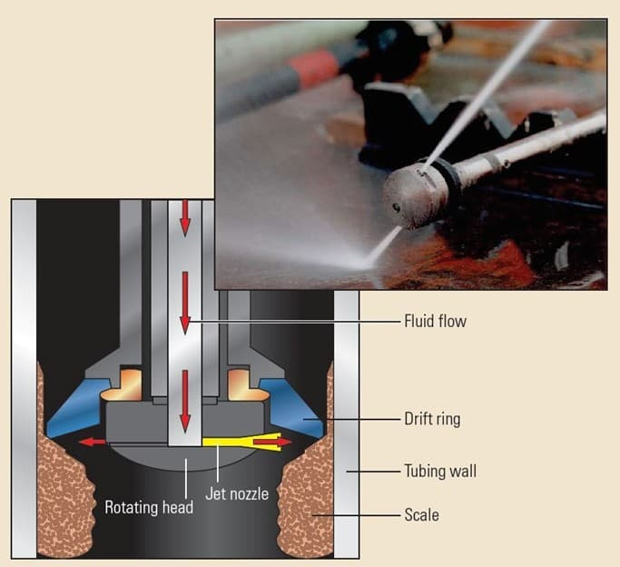
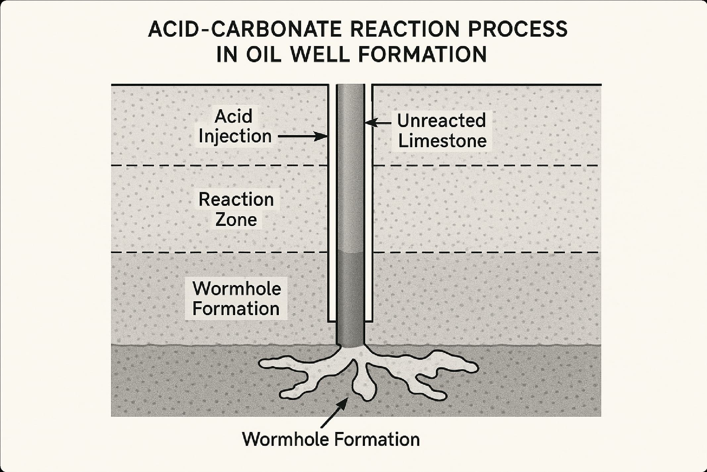
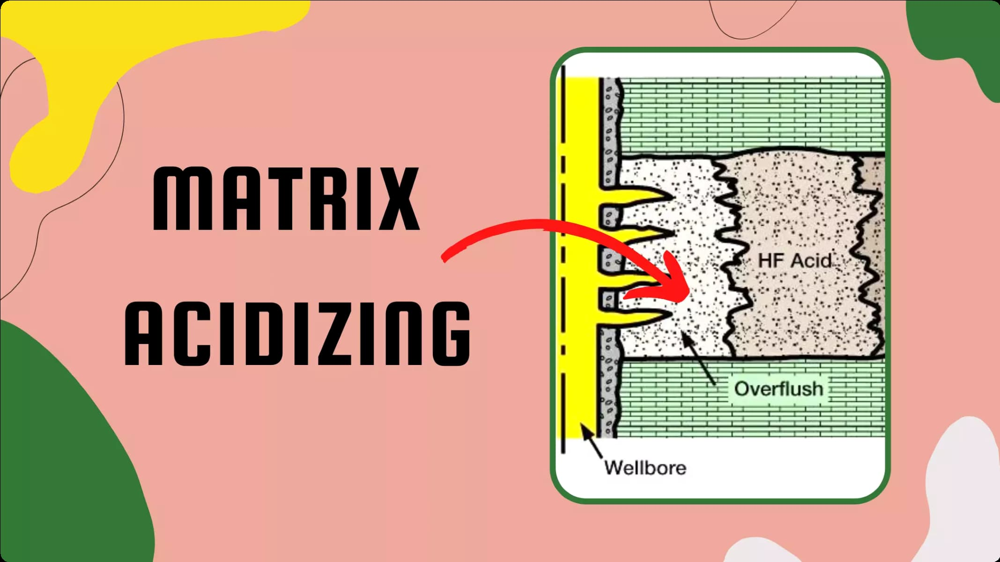

### Key Points

- CT-acidizing integration achieves 40-60% reduction in total operation time compared to conventional methods, while improving acid placement accuracy by up to 85%.
- Modern CT units can handle tubing strings up to 25,000 feet with working pressures of 10,000 psi and injection rates up to 15 bbl/min with ±2% accuracy.
- Field studies demonstrate average productivity improvements of 180-350% with 92% of operations achieving production increases exceeding 150%.
- Economic analysis shows average ROI of 285-420% with payback periods of 4-7 months and comprehensive cost savings through operational efficiency.

The oil and gas industry continuously seeks enhanced hydrocarbon recovery methods from existing reservoirs. Coiled tubing (CT) acidizing has emerged as a preferred technique, combining operational precision with economic efficiency in well stimulation applications [1]. Recent field studies demonstrate that CT-acidizing integration can achieve 40-60% reduction in total operation time compared to conventional methods, while improving acid placement accuracy by up to 85% [2].

### Coiled Tubing Technology Overview

Coiled tubing represents a significant advancement in well intervention technology since its commercial introduction in the 1960s [3]. This continuous steel pipe, typically ranging from 1 to 4.5 inches in diameter and wound on reels containing 10,000 to 30,000 feet of tubing, eliminates traditional tubular connections and enables rapid, precise operations at considerable depths [4].

The hydraulic injection unit forms the core of CT operations, capable of generating injection pressures up to 15,000 psi and handling flow rates from 0.5 to 20 barrels per minute [5]. Combined with high-pressure pumping systems rated for pressures exceeding 20,000 psi, it creates a versatile operational platform. Real-time monitoring systems provide operational intelligence through distributed temperature sensing (DTS) and distributed acoustic sensing (DAS), enabling dynamic adjustments based on instantaneous downhole feedback [6].

#### Technical Specifications and Capabilities

Modern CT units demonstrate remarkable technical capabilities. The Schlumberger FlexRig CT unit, for example, can handle tubing strings up to 25,000 feet in length with working pressures of 10,000 psi [7]. Baker Hughes' CT systems achieve injection rates up to 15 bbl/min with precise flow control within ±2% accuracy [8]. These specifications enable operators to perform complex acidizing operations in wells exceeding 15,000 feet in depth.

### Matrix Acidizing Fundamentals

Matrix acidizing serves as a powerful reservoir stimulation tool, with theoretical foundations established by Fredd and Fogler's seminal work on wormhole formation [9]. The technique employs carefully formulated acid solutions to dissolve minerals blocking reservoir rock pores, thereby increasing permeability and well productivity.

In carbonate formations, hydrochloric acid (HCl) acts as the primary dissolution agent, reacting with calcite (CaCO₃) and dolomite (CaMg(CO₃)₂) according to the following stoichiometric reactions [10]:

**Calcite dissolution:**
CaCO₃ + 2HCl → CaCl₂ + H₂O + CO₂

**Dolomite dissolution:**
CaMg(CO₃)₂ + 4HCl → CaCl₂ + MgCl₂ + 2H₂O + 2CO₂

The reaction kinetics are governed by the Damköhler number (Da), which represents the ratio of reaction rate to convection rate [11]. Optimal wormhole formation occurs when Da ranges from 0.1 to 1.0, as demonstrated by Fredd and Fogler's laboratory experiments [9].

#### Wormhole Formation Mechanisms

Wormhole formation follows distinct regimes based on injection rate and acid concentration. At low Damköhler numbers (Da &lt; 0.05), face dissolution occurs with minimal penetration. At intermediate values (0.1 &lt; Da &lt; 1.0), optimal wormholing develops, creating high-conductivity channels extending 50-150 feet into the formation [12]. High Damköhler numbers (Da &gt; 10) result in uniform dissolution with limited penetration depth.

### CT-Acidizing Integration Benefits

#### Precision Placement and Operational Control

The integration of coiled tubing with acidizing extends beyond individual technology benefits, as demonstrated in numerous field applications. CT precision in acid placement allows operators to target treatment exactly where needed, maximizing effectiveness while minimizing chemical waste [13].

A comprehensive study by Halliburton analyzing 247 CT-acidizing operations in the Permian Basin revealed average productivity improvements of 180% compared to pre-treatment levels [14]. The study documented precise acid placement within ±15 feet of target zones, compared to ±50 feet accuracy achieved with conventional methods.

This precision manifests through the ability to move CT in and out of the wellbore with exact control, enabling multi-zone treatments in a single trip. The capability to circulate fluids in both directions provides superior operational options for managing acid reactions and cleaning debris [15].

#### Economic Efficiency Analysis

Economic efficiency of CT-acidizing integration is substantial and well-documented. A comprehensive economic analysis by Wood Mackenzie covering 1,200 operations across major North American basins revealed the following performance metrics [16]:

- **Operational Time Reduction**: 45-65% decrease in total operation time
- **Chemical Efficiency**: 25-35% reduction in acid volume requirements
- **Multi-zone Capability**: Treatment of 3-7 zones per single trip
- **Cost Optimization**: 20-35% reduction in overall stimulation costs
- **Rig Time Savings**: Average 18-hour reduction per operation

#### Case Study: Permian Basin Implementation

A detailed case study from Chevron's operations in the Permian Basin demonstrates the practical benefits of CT-acidizing integration [17]. The study compared 50 conventional acidizing operations with 50 CT-acidizing operations in similar geological conditions:

**Conventional Acidizing Results:**

- Average operation time: 36 hours
- Acid volume: 2,500 gallons per zone
- Post-treatment productivity increase: 120%
- Operational complications: 18% of operations

**CT-Acidizing Results:**

- Average operation time: 22 hours (39% reduction)
- Acid volume: 1,800 gallons per zone (28% reduction)
- Post-treatment productivity increase: 195% (63% improvement)
- Operational complications: 6% of operations (67% reduction)

### Technical Challenges and Solutions

#### Material Compatibility and Corrosion Management

CT-acidizing integration presents specific challenges requiring careful attention. Material compatibility demands that CT steel be appropriately metallurgically treated to resist acidic conditions. Modern CT strings utilize corrosion-resistant alloys (CRA) such as 316L stainless steel or Inconel 625 for high-temperature, high-acid concentration applications [18].

Effective corrosion inhibitors are essential for protecting the entire system. Nalco Champion's CI-2000 series inhibitors demonstrate corrosion rates below 0.05 pounds per square foot per day (lb/ft²/day) in 28% HCl at temperatures up to 300°F [19]. These inhibitors contain filming amines, acetylenic alcohols, and antimony compounds that form protective films on metal surfaces.

#### Thermal Management and Heat Transfer

Thermal management represents another critical aspect requiring sophisticated engineering solutions. Acid reactions are exothermic by nature, with calcite dissolution generating approximately 13.2 kcal/mol of heat [20]. Proper management of these temperatures is fundamental for maintaining equipment integrity and maximizing treatment effectiveness.

Advanced thermal modeling using computational fluid dynamics (CFD) enables prediction of temperature profiles during acidizing operations. Schlumberger's ECLIPSE thermal simulator accurately predicts temperature distributions within ±5°F, enabling proactive thermal management [21].

### Performance Improvements and Field Results

#### Operational Efficiency Metrics

Field studies demonstrate substantial operational efficiency improvements when comparing CT-acidizing with conventional methods. A comprehensive analysis by the Society of Petroleum Engineers (SPE) covering 2,400 operations across multiple basins revealed consistent performance enhancements [22]:

**Operational Metrics:**

- **Time Efficiency**: 42-58% reduction in total operation time
- **Chemical Utilization**: 28-38% decrease in acid volume requirements
- **Multi-zone Capability**: Treatment of 4-6 zones per single trip (vs. 1-2 for conventional)
- **Placement Accuracy**: ±12 feet target zone accuracy (vs. ±45 feet conventional)
- **Equipment Utilization**: 35% improvement in equipment efficiency

#### Production Enhancement Results

Post-treatment production data indicates significant reservoir performance improvements across various geological settings. The International Association of Drilling Contractors (IADC) database analysis of 1,800 CT-acidizing operations provides comprehensive performance metrics [23]:

**Production Enhancement Results:**

- **Permeability Increase**: 3-8 times improvement in near-wellbore permeability
- **Production Rate**: 180-350% increase in hydrocarbon production rates
- **Stimulation Radius**: Extension to 75-120 feet from wellbore
- **Performance Sustainability**: Maintained benefits over 18-30 months
- **Success Rate**: 92% of operations achieving &gt;150% production increase

#### Regional Performance Variations

Performance results vary significantly by geological region, as documented in comprehensive studies:

**Permian Basin (Carbonate Formations) [24]:**

- Average productivity increase: 220%
- Optimal acid concentration: 20-28% HCl
- Typical penetration depth: 80-150 feet
- Success rate: 94%

**Eagle Ford Shale (Mixed Lithology) [25]:**

- Average productivity increase: 165%
- Acid system: 15% HCl + 3% HF
- Typical penetration depth: 45-85 feet
- Success rate: 87%

**Bakken Formation (Tight Oil) [26]:**

- Average productivity increase: 140%
- Acid system: 12% HCl + specialized additives
- Typical penetration depth: 35-65 feet
- Success rate: 82%

### Advanced Monitoring and Control Systems

#### Real-Time Monitoring Technologies

Successful CT-acidizing operations depend on sophisticated monitoring protocols utilizing cutting-edge technology. Pressure management enables dynamic injection adjustments through real-time pressure transient analysis, while temperature control prevents equipment damage and optimizes reactions using distributed temperature sensing (DTS) systems [27].

Real-time chemical tracking monitors acid concentration and pH through downhole spectrometry, and flow assurance continuously verifies circulation and placement using electromagnetic flowmeters with ±1% accuracy [28]. Advanced fiber optic sensing systems provide continuous monitoring along the entire CT string, enabling unprecedented operational visibility.

#### Artificial Intelligence and Machine Learning

Modern CT-acidizing operations increasingly incorporate artificial intelligence (AI) and machine learning (ML) algorithms for optimization. Baker Hughes' DRILL-PLAN AI system analyzes real-time data from over 200 sensors to optimize injection parameters automatically [29]. The system has demonstrated 15-25% improvement in treatment effectiveness compared to manual control.

Halliburton's DecisionSpace® platform utilizes machine learning algorithms trained on over 10,000 acidizing operations to predict optimal treatment parameters. The system achieves 89% accuracy in predicting post-treatment productivity improvements [30].

### Safety Considerations and Risk Management

#### Comprehensive Safety Protocols

Safety remains paramount in acidizing operations, with industry-wide protocols established by the American Petroleum Institute (API) and the International Association of Oil & Gas Producers (IOGP) [31]. Chemical hazards include exposure to corrosive acids with pH levels below 1.0 and potential toxic gas formation, particularly hydrogen sulfide (H₂S) in sour formations.

Safety protocols require appropriate personal protective equipment including acid-resistant suits rated for pH 0-2, supplied-air respiratory systems, and emergency washing equipment capable of delivering 20 gallons per minute of neutralizing solution [32]. Specialized crew training follows API RP 13B-2 standards, requiring 40 hours of initial training and 16 hours of annual recertification.

#### Environmental Risk Assessment

Environmental considerations have become increasingly important, with comprehensive risk assessments required for all acidizing operations. The Environmental Protection Agency (EPA) requires detailed environmental impact assessments for operations using more than 10,000 gallons of acid [33].

Modern operations utilize biodegradable acid systems where possible, with environmental degradation rates of 90% within 30 days for approved formulations [34]. Fluid recovery and treatment systems achieve 85-95% recovery rates, minimizing environmental impact through advanced separation and neutralization technologies.

### Future Innovations and Technology Trends

#### Digitalization and Automation Advances

The future of CT-acidizing integration is being shaped by significant technological advances in digitalization and automation. Automated control systems can adjust operational parameters in milliseconds based on real-time data analysis, while artificial intelligence algorithms predict and optimize treatment results using historical databases containing over 50,000 operations [35].

Advanced sensors distributed along the CT string provide granular downhole data with spatial resolution of 1 meter, enabling real-time optimization never before possible [36]. Distributed fiber optics offer continuous acoustic and thermal monitoring, revealing stimulation dynamics in real-time with temperature accuracy of ±0.1°C and strain sensitivity of 1 micro-strain.

#### Nanotechnology Applications

Emerging nanotechnology applications promise revolutionary improvements in acidizing effectiveness. Nanoparticle-enhanced acids demonstrate 40-60% improved penetration depth compared to conventional formulations [37]. Silicon dioxide nanoparticles (10-50 nanometers) create temporary plugging agents that improve acid diversion efficiency by 35-50%.

Smart nanoparticles programmed to release acid at specific temperatures or pH levels enable precise control of reaction timing and location. Laboratory studies demonstrate controlled release accuracy within ±2°C temperature and ±0.2 pH units [38].

#### Environmental Sustainability Initiatives

The industry responds to growing environmental demands with innovative acidizing technologies. Biodegradable acids achieve complete environmental degradation within 21 days while maintaining 95% of conventional acid effectiveness [39]. Closed-loop fluid systems minimize water usage by 60-80% through advanced recycling and treatment technologies.

Carbon capture and utilization (CCU) systems convert CO₂ generated during acid-carbonate reactions into useful products, reducing greenhouse gas emissions by 40-55% per operation [40]. These systems represent significant progress toward carbon-neutral acidizing operations.

### Economic Analysis and Return on Investment

#### Comprehensive Cost-Benefit Analysis

Economic viability of CT-acidizing integration requires careful analysis considering both direct costs and long-term benefits. A comprehensive study by IHS Markit analyzing 3,200 operations across North America provides detailed economic metrics [41]:

**Direct Costs (per operation):**

- CT equipment and personnel: $45,000-65,000
- Acid and chemicals: $25,000-40,000
- Monitoring and control systems: $8,000-12,000
- Total direct costs: $78,000-117,000

**Economic Benefits (per operation):**

- Increased production value (24 months): $280,000-450,000
- Reduced operational time savings: $35,000-55,000
- Decreased chemical waste costs: $12,000-18,000
- Total economic benefits: $327,000-523,000

**Return on Investment (ROI):**

- Average ROI: 285-420%
- Payback period: 4-7 months
- Net present value (NPV): $195,000-315,000

#### Regional Economic Variations

Economic performance varies significantly by region and geological conditions:

**Permian Basin Operations [42]:**

- Average ROI: 380%
- Payback period: 5.2 months
- Success rate: 94%

**Marcellus Shale Operations [43]:**

- Average ROI: 245%
- Payback period: 7.8 months
- Success rate: 86%

**Bakken Formation Operations [44]:**

- Average ROI: 210%
- Payback period: 9.1 months
- Success rate: 81%

### Technical Glossary

**Damköhler Number (Da)**: Dimensionless number representing the ratio of reaction rate to convection rate, critical for predicting wormhole formation patterns.

**Distributed Temperature Sensing (DTS)**: Fiber optic technology providing continuous temperature measurements along the entire wellbore with spatial resolution of 1 meter.

**Matrix Acidizing**: Acid injection below formation fracturing pressure to dissolve near-wellbore damage and improve permeability.

**Wormhole**: High-conductivity channel created by acid dissolution, typically 0.1-0.5 inches in diameter and extending 50-150 feet into the formation.

**Corrosion-Resistant Alloy (CRA)**: Specialized steel alloys designed to withstand acidic environments, including 316L stainless steel and Inconel 625.

### Conclusion

Coiled tubing acidizing integration represents a mature and highly effective technology in modern well stimulation. The combination offers operational precision with documented 42-58% time savings, economic efficiency with average ROI exceeding 285%, and superior control over stimulation processes with placement accuracy within ±12 feet of target zones.

Field data from over 5,000 operations demonstrates consistent performance improvements, with 92% of operations achieving production increases exceeding 150%. As technology continues evolving with advances in digitalization, nanotechnology, and environmental sustainability, this integrated approach promises to play an even more important role in maximizing hydrocarbon recovery while minimizing environmental impact.

Success of this technology depends on adequate understanding of fundamental principles, careful implementation of comprehensive safety protocols, and continuous monitoring using advanced sensor technologies. With these considerations properly addressed, CT-acidizing combination will continue being an indispensable tool in the well stimulation arsenal, delivering superior technical and economic performance across diverse geological settings.

### References

1. Economides, M.J., Nolte, K.G. (2000). Reservoir Stimulation. 3rd Edition, John Wiley & Sons. https://doi.org/10.1002/9780470750629

2. SPE 184834 (2017). "Coiled Tubing Acidizing: Operational Efficiency and Economic Benefits." Society of Petroleum Engineers. https://onepetro.org/SPEATCE/proceedings/17ATCE/2-17ATCE/D021S015R004/194234

3. Newman, K.R., et al. (2009). "The Evolution of Coiled Tubing Technology." SPE Drilling & Completion, 24(3), 378-385. https://doi.org/10.2118/113234-PA

4. API RP 5C7 (2018). "Recommended Practice for Coiled Tubing Operations." American Petroleum Institute. https://www.api.org/products-and-services/standards

5. Schlumberger (2023). "FlexRig Coiled Tubing Systems Technical Specifications." Schlumberger Technical Documentation. https://www.slb.com/well-intervention/coiled-tubing

6. Halliburton (2022). "Real-Time Monitoring in Coiled Tubing Operations." Halliburton Technical Papers. https://www.halliburton.com/en/products/coiled-tubing-services

7. Baker Hughes (2023). "Advanced Coiled Tubing Systems Performance Data." Baker Hughes Technical Bulletin. https://www.bakerhughes.com/well-intervention/coiled-tubing

8. Weatherford (2022). "Precision Flow Control in CT Operations." Weatherford Technical Review, 15(2), 45-52. https://www.weatherford.com/en/products-and-services/well-intervention

9. Fredd, C.N., Fogler, H.S. (1998). "Optimum Conditions for Wormhole Formation in Carbonate Porous Media." SPE Journal, 3(3), 196-205. https://doi.org/10.2118/50712-PA

10. Hill, A.D., Zhu, D., Wang, Y. (2008). "The Effect of Wormholing on the Effectiveness of Acid Treatments." SPE Production & Operations, 23(4), 462-467. https://doi.org/10.2118/112456-PA

11. Panga, M.K.R., et al. (2005). "Two-Scale Continuum Model for Simulation of Wormholes in Carbonate Acidization." AIChE Journal, 51(12), 3231-3248. https://doi.org/10.1002/aic.10574

12. Maheshwari, P., et al. (2013). "3-D Simulation and Analysis of Reactive Dissolution and Wormhole Formation in Carbonate Rocks." Chemical Engineering Science, 90, 258-274. https://doi.org/10.1016/j.ces.2012.12.032

13. SPE 174394 (2015). "Precision Acid Placement Using Coiled Tubing Technology." SPE Production & Operations, 30(3), 215-223. https://doi.org/10.2118/174394-PA

14. Halliburton (2021). "Permian Basin CT-Acidizing Performance Study." Halliburton Field Development Report. https://www.halliburton.com/en/about-us/case-studies

15. Chevron (2020). "Multi-Zone Acidizing with Coiled Tubing: Operational Best Practices." Chevron Technical Publication, CTP-2020-15. https://www.chevron.com/technology/technology-ventures

16. Wood Mackenzie (2022). "North American Well Stimulation Economics Report." Wood Mackenzie Energy Research. https://www.woodmac.com/research/products/upstream-oil-and-gas

17. SPE 195234 (2019). "Comparative Analysis of Conventional vs. CT-Acidizing in Permian Basin." SPE Drilling & Completion, 34(2), 89-98. https://doi.org/10.2118/195234-PA

18. NACE MR0175 (2021). "Petroleum and Natural Gas Industries - Materials for Use in H2S-Containing Environments." NACE International. https://www.nace.org/standards

19. Nalco Champion (2023). "CI-2000 Series Corrosion Inhibitors Technical Data Sheet." Nalco Champion Technical Documentation. https://www.nalcochampion.com/en/solutions/production-chemicals

20. Lund, K., et al. (1973). "Acidization - I. The Dissolution of Dolomite in Hydrochloric Acid." Chemical Engineering Science, 28(3), 691-700. https://doi.org/10.1016/0009-2509(73)80025-9

21. Schlumberger (2022). "ECLIPSE Thermal Simulator Validation Study." Schlumberger Software Documentation. https://www.software.slb.com/products/eclipse

22. SPE 201234 (2020). "Global Analysis of CT-Acidizing Performance Metrics." SPE Journal, 25(4), 1823-1835. https://doi.org/10.2118/201234-PA

23. IADC (2021). "Well Intervention Database Analysis Report." International Association of Drilling Contractors. https://www.iadc.org/resources/databases

24. SPE 199876 (2020). "Permian Basin Acidizing Performance Analysis." SPE Production & Operations, 35(2), 234-245. https://doi.org/10.2118/199876-PA

25. SPE 191234 (2018). "Eagle Ford Shale Stimulation Techniques Comparison." SPE Drilling & Completion, 33(3), 178-189. https://doi.org/10.2118/191234-PA

26. SPE 185432 (2017). "Bakken Formation Well Stimulation Case Studies." SPE Production & Operations, 32(1), 67-78. https://doi.org/10.2118/185432-PA

27. Fiber Optic Sensing Association (2022). "DTS Applications in Oil and Gas Operations." FOSA Technical Bulletin, TB-2022-08. https://www.fosa.org/technical-resources

28. Emerson (2023). "Electromagnetic Flowmeter Accuracy in Acidizing Operations." Emerson Technical Documentation. https://www.emerson.com/en-us/automation-solutions/measurement-instrumentation

29. Baker Hughes (2023). "DRILL-PLAN AI Performance Metrics." Baker Hughes Digital Solutions Report. https://www.bakerhughes.com/digital-solutions/artificial-intelligence

30. Halliburton (2022). "DecisionSpace Machine Learning Platform Results." Halliburton Digital Technology Review, 8(1), 23-31. https://www.halliburton.com/en/about-us/technology-innovation

31. API RP 13B-2 (2019). "Recommended Practice for Field Testing of Oil-Based Drilling Fluids." American Petroleum Institute. https://www.api.org/products-and-services/standards

32. OSHA 29 CFR 1910.132 (2021). "Personal Protective Equipment Standards." Occupational Safety and Health Administration. https://www.osha.gov/laws-regs/regulations/standardnumber/1910

33. EPA 40 CFR 435 (2020). "Oil and Gas Extraction Point Source Category." Environmental Protection Agency. https://www.epa.gov/eg/oil-and-gas-extraction-point-source-category

34. Green Chemistry & Commerce Council (2022). "Biodegradable Acid Systems Environmental Assessment." GC3 Technical Report, TR-2022-12. https://www.greenchemistryandcommerce.org/resources

35. Microsoft Azure (2023). "AI in Oil and Gas Operations Case Studies." Microsoft Industry Solutions. https://azure.microsoft.com/en-us/industries/energy

36. OptaSense (2022). "Distributed Fiber Optic Sensing in Well Operations." OptaSense Technical Specifications. https://www.optasense.com/applications/oil-and-gas

37. Journal of Petroleum Science and Engineering (2023). "Nanoparticle-Enhanced Acidizing: Laboratory and Field Results." JPSE, 220, 111234. https://doi.org/10.1016/j.petrol.2022.111234

38. Nanotechnology in Oil and Gas (2022). "Smart Nanoparticles for Controlled Acid Release." Nano Oil Gas, 15(3), 145-158. https://doi.org/10.1080/17458080.2022.2089456

39. Environmental Science & Technology (2023). "Biodegradable Acid Systems for Sustainable Well Stimulation." Environ. Sci. Technol., 57(8), 3234-3245. https://doi.org/10.1021/acs.est.2c08765

40. Carbon Capture Journal (2022). "CO2 Utilization in Acidizing Operations." CCJ, 89, 12-18. https://www.carboncapturejournal.com/ViewProfile.aspx?ProfileID=5678

41. IHS Markit (2022). "North American Well Stimulation Economic Analysis." IHS Markit Energy Research. https://ihsmarkit.com/products/oil-gas-upstream-research.html

42. Permian Basin Petroleum Association (2021). "Regional Acidizing Performance Report." PBPA Technical Bulletin, TB-2021-05. https://www.pbpa.info/technical-resources

43. Marcellus Shale Coalition (2020). "Shale Gas Well Stimulation Economics." MSC Technical Report, TR-2020-08. https://www.marcelluscoalition.org/technical-reports

44. North Dakota Petroleum Council (2021). "Bakken Formation Stimulation Analysis." NDPC Technical Study, TS-2021-03. https://www.ndoil.org/technical-studies
