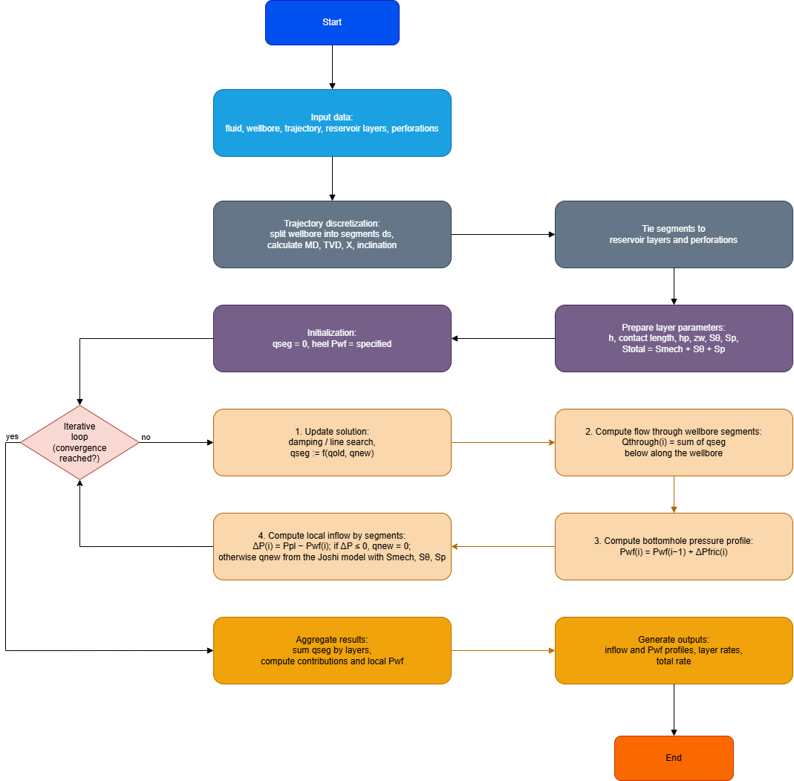
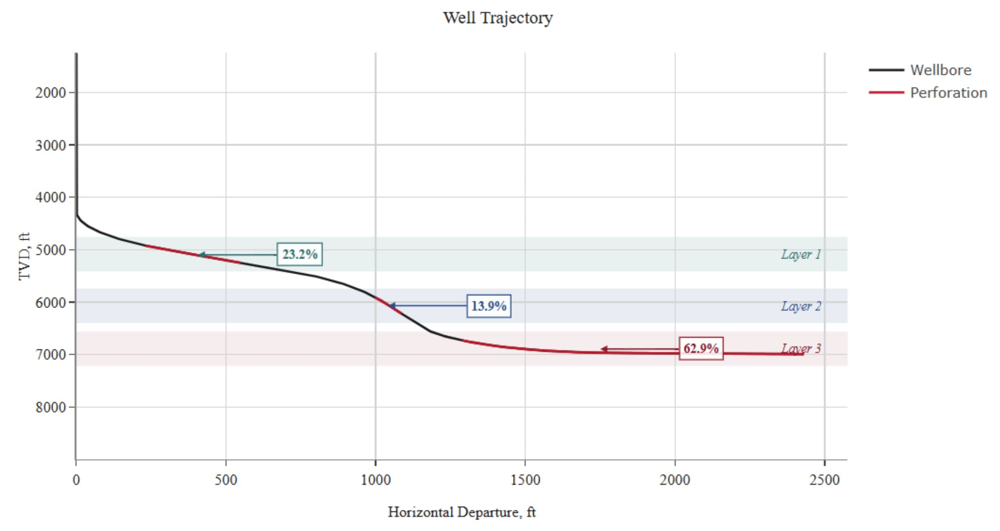
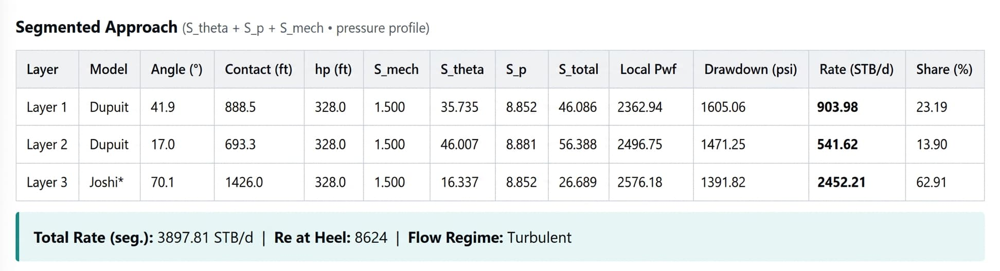
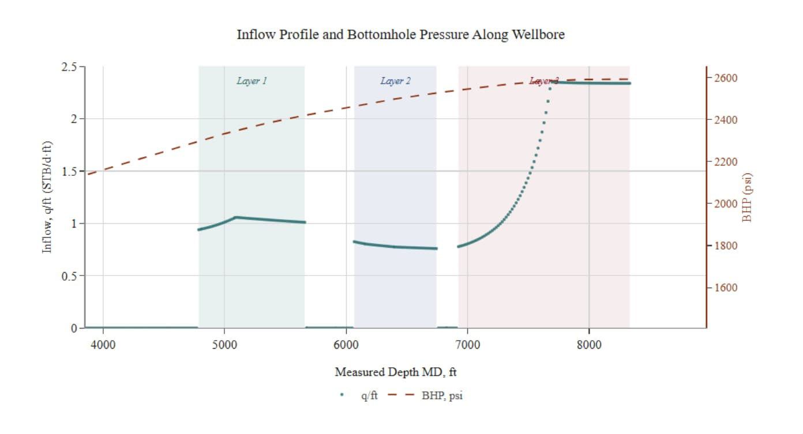
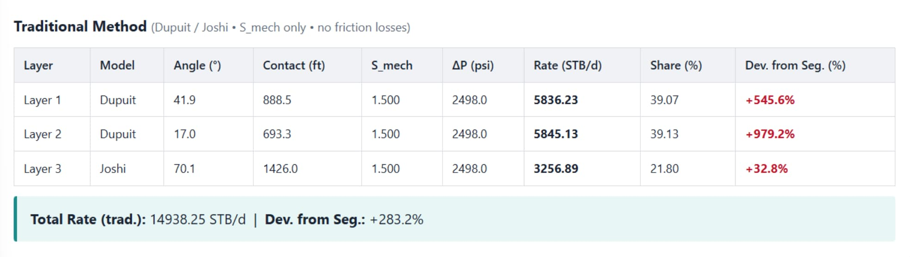

## Введение

В современной нефтегазовой инженерии разработка залежей все чаще опирается на скважины со сложными траекториями, включая наклонные, горизонтальные и S-образные стволы. Такие скважины существенно увеличивают площадь контакта с пластом, повышают эффективность дренирования и улучшают извлечение углеводородов из многопластовых объектов. Однако оценка продуктивности в таких условиях усложняется из-за совместного влияния геометрии ствола, угла наклона, анизотропии проницаемости, частичного вскрытия пластов, скин-факторов и потерь давления на трение внутри ствола.

Классические аналитические решения для притока изначально выводились для вертикальных или горизонтальных скважин и часто не способны полноценно описать поведение скважин со сложной траекторией, пересекающих несколько продуктивных пластов. Поэтому требуется интегрированный расчетный подход, который объединяет разные модели притока и учитывает пространственную геометрию ствола.

В статье представлена методика расчета продуктивности скважин со сложной траекторией в многопластовых коллекторах. Предлагаемый алгоритм основан на дискретизации ствола на сегменты и применении проверенных аналитических моделей, включая решение Dupuit для радиального притока и модель Joshi для горизонтальных скважин, с учетом скин-факторов и потерь давления на трение вдоль ствола. Такой подход позволяет точнее оценивать распределение притока вдоль ствола и суммарный дебит скважины.

## Метод расчета продуктивности скважин со сложной траекторией в многопластовых коллекторах

Методика описывает алгоритм определения продуктивности скважин со сложными траекториями (наклонных, горизонтальных, S-образных), пересекающих несколько изолированных продуктивных пластов, с учетом угла наклона ствола, анизотропии, скин-факторов и потерь давления на трение в стволе.

Подход опирается на классические решения для притока к вертикальным и горизонтальным скважинам (Dupuit, Joshi, Economides) и корреляции скин-факторов для наклонных скважин (Cinco-Ley, Besson и последующие обобщения).

### 1. Расчет притока к наклонным скважинам

Для сегментов ствола, где угол наклона находится вне горизонтального диапазона, структура потока приближается к радиальной, и применяется формула Dupuit для установившегося притока к вертикальной скважине:

$$
q = \frac{2\pi kh\Delta P}{\mu B\left(\ln\left(\frac{R_{e}}{r_{w}}\right) - 0.75 + S_{total}\right)}
$$

где:

- k — проницаемость пласта (мД, с переводом в м² для расчетов);
- h — эффективная толщина пласта (m);
- $$\Delta P = P_{res} - P_{wf}$$ — депрессия (atm или Pa в зависимости от системы единиц);
- $$\mu$$ — вязкость нефти (mPa·s → Pa·s);
- B — объемный коэффициент нефти (безразмерный);
- $$R_{e}/r_{w}$$ — отношение радиуса дренирования к радиусу скважины;
- $$S_{total}$$ — суммарный скин-фактор (см. [раздел 3](#section-3)).

Классическая постоянная в знаменателе соответствует псевдоскину для радиального притока к полностью вскрытой вертикальной скважине и приведена, например, у Economides et al.

### 2. Расчет притока к горизонтальным скважинам

Для сегментов с углом наклона θ от 80° до 90° (приближенно горизонтальный ствол) используется модель Joshi для установившегося притока к горизонтальной скважине в анизотропном пласте:

$$
q = \frac{kh\Delta P}{\mu B \, \mathit{Denom}}
$$

где знаменатель $$\mathit{Denom}$$ учитывает эллиптическую геометрию дренирования и анизотропию пласта:

#### 1. **Большая полуось эллипса** (α):

$$
a = \frac{L}{2}\left[0.5 + \sqrt{0.25 + \left(\frac{2r_e}{L}\right)^4}\right]^{0.5}
$$

#### 2. **Коэффициент анизотропии** (β), вводимый как $$I_{ani}$$ или отношение проницаемостей:

$$
\beta = \sqrt{\frac{k_h}{k_v}} \text{ или } \beta = \sqrt{I_{ani}}
$$

#### 3. **Эффективная толщина** (h′):

$$
h^{\prime} = h \cdot \beta
$$

#### 4. **Логарифмические члены Joshi** в одной из распространенных форм:

$$
\begin{aligned}
\ln_1 &= \ln\left(\frac{a}{L/2} + \sqrt{\left(\frac{a}{L/2}\right)^2 - 1}\right) \\ \\
\ln_2 &= \ln\left(\frac{h^{\prime}}{L} \cdot \frac{1 + \beta}{\beta}\right) \\ \\
\ln_3 &= \ln\left(\frac{h^{\prime}}{2r_w} \cdot \sqrt{\frac{h^{\prime}}{L} \cdot \frac{1 + \beta}{\beta}}\right)
\end{aligned}
$$

Тогда:

$$
\mathit{Denom} = \ln_1 + \ln_2 - \ln_3 + S
$$

где $$S$$ — скин-фактор (механический и другие компоненты, см. [раздел 3](#section-3)).

Модель Joshi подробно описана в Horizontal Well Technology и обобщена для разных геометрий дренирования в Petroleum Production Systems.

### 3. Расчет скин-факторов

Суммарный скин-фактор для каждого сегмента ствола рассматривается как аддитивная величина:

$$
S_{total} = S_{mech} + S_{\theta} + S_{p}
$$

#### 3.1. **Механический скин-фактор** $$S_{mech}$$

$$S_{mech}$$ отражает фильтрационное сопротивление из-за загрязнения призабойной зоны фильтратом бурового раствора, повреждения перфорации, неравномерного вскрытия и других факторов. Обычно его калибруют по данным исследований скважины (WDT/PLT) или принимают по стандартным корреляциям (Economides, Babu-Odeh и др.).

#### 3.2. **Скин-фактор угла наклона**

Для наклонных участков $$(0 < θ < 90°)$$ применяется корреляция геометрического псевдоскина для наклонных скважин Cinco-Ley и Besson:

$$
S_{\theta} = \frac{h}{r_w} \cdot \sqrt{\frac{k_v}{k_h}} \cdot \frac{|\cos \theta|}{41 - 2 \cdot \left(h / R_e\right)}
$$

- При $$θ → 90°$$, $$S_{θ}$$ переходит к геометрической составляющей модели Joshi для горизонтальной скважины;
- **При росте анизотропии $$(k_{v}/k_{h} ≪ 1)$$ влияние наклона на $$S_{θ}$$ усиливается, что подтверждено классической работой** Besson и современными корреляциями для наклонных скважин.

#### 3.3. **Скин-фактор частичного вскрытия** $$S_{p}$$

Скин-фактор частичного вскрытия учитывает дополнительное сопротивление притоку, возникающее, когда ствол пересекает только часть эффективной толщины $$h$$ и заканчивается внутри пласта.

В этом случае линии тока сходятся к концам открытого интервала, увеличивая депрессию по сравнению с полностью вскрытой скважиной.

Для количественной оценки применяется широко цитируемая аналитическая аппроксимация Papatzacos (1987), используемая при анализе притока и интерпретации исследований скважин с частично вскрытыми и перфорированными интервалами.

#### Алгоритм расчета $$S_{p}$$

#### 1. **Безразмерная толщина** $$h_{D}$$

$$
h_{D} = \frac{h}{r_w} \cdot \sqrt{\frac{k_h}{k_v}}
$$

где $$k_h, k_v$$ — горизонтальная и вертикальная проницаемости, $$r_w$$ — радиус ствола.

#### 2. **Геометрический параметр** $$b$$

Параметр $$b$$ описывает геометрию частично вскрытого интервала относительно границ пласта и учитывает асимметрию потока при смещении открытого интервала от центра пласта:

$$
b = \frac{h / h_p}{2 + h / h_p} \cdot \sqrt{\frac{\left(z_w + h_p / 4\right)\left(h - z_w + h_p / 4\right)}{\left(z_w - h_p / 4\right)\left(h - z_w - h_p / 4\right)}}
$$

где:

- $$h_p$$ — вскрытая (перфорированная) толщина пласта;
- $$z_w = h - h_p / 2$$ — координата середины открытого интервала относительно кровли пласта.

#### 3. **Итоговая формула** $$S_{p}$$

$$
S_{p} = \left(\frac{h}{h_p} - 1\right) \cdot \ln\left(\frac{\pi \cdot h_D}{2}\right) + \frac{h}{h_p} \cdot \ln(b)
$$

Первый член отражает влияние отношения полной и вскрытой толщины $$h / h_p$$ и анизотропии через $$h_D$$, второй дает поправку на положение интервала внутри пласта через $$b$$. При $$h_p \to h$$ и симметричном расположении интервала $$S_p$$ согласуется с решениями для полностью вскрытых скважин.

### 4. Алгоритм расчета для сложных траекторий (модель радиального канала)

Для скважин с криволинейной траекторией, пересекающих несколько пластов, применяется сегментный подход (дискретизированная модель ствола/сегментов).

**Этап 1: дискретизация ствола**

1. Ствол делится на сегменты длиной $$\Delta L$$ (обычно 5-10 m; шаг выбирается по плавности траектории и разрешению данных инклинометрии/каротажа).
2. Для каждого сегмента $$i$$ по данным инклинометрии определяются:

- средний угол наклона $$\theta_i$$;
- координаты и принадлежность к конкретному пласту $$j$$;
- локальные петрофизические параметры $$(k_j, h_j, p_{res,j})$$.

**Этап 2: выбор расчетной модели по углу**

Для каждого сегмента выбирается модель притока:

- Если $$70^\circ \le \theta_i \le 120^\circ$$: используется модель горизонтальной скважины Joshi ([раздел 2](#section-2));
- Если $$\theta_i < 70^\circ$$ или $$\theta_i > 120^\circ$$: используется формула Dupuit ([раздел 1](#section-1)) с $$S_{total}$$, включая $$S_{\theta}$$.

Для сегментов, частично вскрывающих пласт, дополнительно рассчитывается $$S_p$$ (см. 3.3).

**Этап 3: учет потерь давления на трение в стволе**

Депрессия для сегмента $$i$$ определяется как:

$$
\Delta P_i = P_{res,j} - \left(P_{wf,heel} + \Delta P_{fric,i}\right)
$$

где $$\Delta P_{fric,i}$$ — потери давления на трение в участке ствола от сегмента $$i$$ до пятки.

Потери на трение можно оценивать по уравнению Дарси-Вейсбаха или стандартным трубным корреляциям (в зависимости от режима потока и фазового состава), используя текущий суммарный расход в соответствующем участке ствола.

Общее решение является итерационным:

1. Задать начальное распределение дебитов по сегментам, например пропорционально $$k \cdot h$$.
2. Рассчитать $$\Delta P_{fric,i}$$ вдоль ствола.
3. Пересчитать $$\Delta P_i$$ и приток $$q_{i,j}$$ по моделям Dupuit/Joshi.
4. Повторять до сходимости по суммарному дебиту и забойному давлению $$P_{wf}$$.

Такой подход описан в исследованиях по индикаторным кривым притока для горизонтальных и наклонных скважин: игнорирование трения приводит к завышению продуктивности и ошибкам в прогнозе времени прорыва воды/газа.

**Этап 4: суммирование дебитов**

Суммарный дебит скважины:

$$
Q_{total} = \sum_{j=1}^{n} \sum_{i=1}^{m_j} q_{i,j}
$$

где:

- $$j$$ — индекс пласта;
- $$i$$ — индекс сегмента, принадлежащего пласту $$j$$;
- $$q_{i,j}$$ — приток из сегмента $$i$$ пласта $$j$$, рассчитанный выбранной моделью.

Дополнительно можно построить профиль притока вдоль ствола и по пластам, чтобы оценить эффективность вскрытия и выявить зоны с избыточным сопротивлением (высоким $$S_{total}$$).

## Пример применения сегментной модели скважины для оценки продуктивности S-образной скважины

В качестве демонстрационного примера рассматривается сценарий, показывающий влияние траектории скважины на профиль притока. Три гидравлически изолированных пласта имеют одинаковые петрофизические и фильтрационные свойства, но пересекаются стволом с разной геометрией. Сравнение сегментной модели скважины с упрощенной аналитической моделью по пластам показывает не только значительные количественные расхождения, но и качественное искажение физической картины распределения притока.

### Постановка задачи и исходные данные

Рассматривается S-образная скважина, пересекающая три продуктивных пласта. Пласты имеют одинаковые свойства: проницаемость 100 мД, анизотропию проницаемости $$k_{v} / k_{h} = 0.30$$, пластовое давление 270 атм и механический скин-фактор $$S_{mech}$$. Диаметр ствола — 0.05 м, забойное давление у пятки — 100 атм. Каждый пласт имеет толщину 200 м, перфорированный интервал расположен по центру и равен 100 м (50% вскрытия пласта, рисунок 1).

Сегментный подход представляет ствол как дискретный набор сегментов. Для каждого сегмента по данным траектории (инклинометрии) определяются угол наклона, принадлежность к пласту и локальные свойства. Затем выбирается соответствующая модель притока (радиальная или квазигоризонтальная), а также учитываются компоненты скин-фактора: механический, угловой псевдоскин и скин частичного вскрытия. После этого локальная депрессия итерационно обновляется с учетом накопленных потерь давления вдоль ствола. [1, 2](https://www.bsee.gov/sites/bsee.gov/files/tap-technical-assessment-program/307ad.pdf)

### Результаты моделирования и анализ перераспределения притока

По сегментной модели дебиты по пластам составили 143.7, 86.0 и 389.7 м³/сут соответственно, что дает суммарный дебит скважины 619.5 м³/сут. Доля каждого пласта в общем притоке составляет 23.2%, 13.9% и 62.9% соответственно (рисунок 2).

Поскольку петрофизические свойства пластов одинаковы, неравномерный профиль притока определяется исключительно пространственной конфигурацией ствола и гидравлическими потерями в нем. Геометрия пересечения характеризуется средними углами наклона 41.9°, 17.0° и 70.1° для соответствующих пластов. Такая ориентация дает угловые псевдоскины $$S_{θ}$$ 35.75, 45.95 и 16.35. Скин частичного вскрытия $$S_{p}$$ одинаков для всех пластов (8.85), поскольку относительная геометрия перфорированных интервалов одинакова [5].

Физический механизм имеет ясную причинно-следственную связь: геометрия ствола определяет локальный псевдоскин, который напрямую управляет сопротивлением притоку в ПЗП и приводит к нелинейному перераспределению притока из пласта. В уравнениях установившейся фильтрации сопротивление потоку находится в знаменателе логарифмической функции, включающей параметры геометрии потока и скин-фактор. Рост суммарного скин-фактора $$S$$ пропорционально снижает коэффициент продуктивности $$PI$$ [3]. Для наклонных и горизонтальных заканчиваний геометрические эффекты становятся доминирующими: эффективное сопротивление критически зависит от угла наклона и анизотропии проницаемости [4].

Суперпозиция всех компонентов скин-фактора (механического, углового и частичного вскрытия) для рассматриваемых пластов дает суммарные значения 46.1, 56.3 и 26.7. Таким образом, общее сопротивление притоку второго пласта более чем в два раза превышает сопротивление третьего, несмотря на то что механическое повреждение пласта составляет всего 1.5. Следовательно, влияние траектории скважины доминирует над классическим эффектом повреждения ПЗП.

### Влияние гидравлических потерь в стволе на локальную депрессию

Критически важный физический механизм, учитываемый сегментной моделью, — снижение локальной депрессии из-за потерь давления на трение вдоль ствола. В рассматриваемом случае локальное забойное давление $$P_{wf}$$ возрастает со 160.85 атм в верхнем (первом) пласте до 175.37 атм в нижнем (третьем) пласте. Возникающий продольный градиент давления около 14.5 атм приводит к пропорциональному снижению локальной депрессии со 109.15 до 94.63 атм (рисунок 3).

В инженерной литературе это явление классифицируется как макроскопическое проявление **эффекта пятка-носок**: потери давления на трение вдоль протяженного участка ствола создают перепад давления между пяткой и носком, формируя асимметричный профиль притока даже в однородном коллекторе [6, 7]. С точки зрения трубной гидравлики распределенные потери на трение описываются **уравнением Дарси-Вейсбаха** [8]. В этом контексте горизонтальную скважину можно рассматривать как систему с распределенным притоком и множеством боковых присоединений, где непрерывное поступление флюида из пласта динамически меняет профиль скорости вдоль ствола и требует связанного решения уравнений течения в стволе и фильтрации в пласте [9, 10].

### Сравнение с аналитической моделью по пластам (упрощенный подход)

Традиционный аналитический подход по пластам использует усредненные свойства коллектора и не учитывает градиенты давления внутри ствола. При одинаковых $$k$$, $$h$$ и $${\Delta P}$$, а также с учетом только механического скин-фактора $$S_{mech}$$ первый и второй пласты дают одинаковый приток. В рамках такого подхода расчетные дебиты составляют 928.2, 928.2 и 518.2 м³/сут, а суммарный дебит скважины — 2374.6 м³/сут (рисунок 4).

Сравнение с сегментной моделью (619.5 м³/сут) показывает, что упрощенная аналитическая модель завышает продуктивность скважины в 3.83 раза (ошибка +283%). Такое расхождение объясняется исходными допущениями модели по пластам: игнорированием углового псевдоскина, отсутствием дополнительного сопротивления из-за частичного вскрытия и предположением равномерного (изобарического) давления вдоль ствола.

В классических моделях кривой притока для горизонтальных скважин невозможность корректно учитывать потери давления на трение является известным ограничением [11]. Базовая формулировка Joshi предполагает эквипотенциальную стенку ствола, что неверно при существенном градиенте давления вдоль длины ствола [12].

### Обсуждение

Полученные результаты ясно демонстрируют фундаментальные ограничения традиционных аналитических подходов, использующих средний угол наклона и эквивалентный радиус дренирования для многопластовых скважин со сложной траекторией. Сегментный анализ показывает, что при анизотропии пласта $$k_{v} / k_{h} < 1$$ локальная ориентация ствола (угол наклона) оказывает непропорционально сильное влияние на сопротивление притоку. В частности, угловой псевдоскин в наклонных интервалах может на порядок превышать механический скин-фактор $$S_{mech}$$ и становиться основным фактором, ограничивающим продуктивность.

Кроме того, исследование подтверждает, что игнорирование гидродинамики ствола (трения) неизбежно приводит к завышению эффективной депрессии в удаленных участках (у носка). Это искажает не только прогноз суммарного дебита, но и профиль притока вдоль ствола. Практические последствия особенно важны для проектирования заканчивания: точный прогноз эффекта пятка-носок необходим для корректного проектирования устройств контроля притока (ICD/AICD), оптимизации диаметров хвостовика и снижения риска преждевременного конусообразования воды или газа в зонах избыточной депрессии у пятки.

### Выводы и практические рекомендации

1. **Неравномерный профиль притока.** В скважинах сложной архитектуры, дренирующих многопластовые коллекторы, профиль притока определяется не только проводимостью пласта $$kh$$, но и в значительной степени геометрией заканчивания (локальным углом наклона и степенью вскрытия). Пласты с одинаковыми свойствами могут давать существенно разные вклады в суммарную добычу.
2. **Доминирование геометрического псевдоскина.** Угловой скин-фактор $$S_{θ}$$ и дополнительное сопротивление частичного вскрытия $$S_{p}$$ могут в несколько раз превышать традиционный механический скин-фактор $$S_{mech}$$. Геометрия траектории становится главным фактором, управляющим сопротивлением притоку в ПЗП.
3. **Важность гидравлических потерь в стволе (эффект пятка-носок).** Трение в наклонных и горизонтальных участках может вызывать значительный рост забойного давления от пятки к носку в длинных высокопродуктивных скважинах, снижая эффективную депрессию в удаленных интервалах. Поэтому итерационная связь с гидравликой ствола необходима для физической согласованности модели.
4. **Ограничения аналитических моделей по пластам.** Классические упрощенные подходы, не учитывающие дискретное распределение притока и потери давления в стволе, существенно завышают прогноз продуктивности (до 280%) и искажают профиль притока. Для S-образных и горизонтальных скважин, а также скважин с радиальными каналами разной длины, сегментная модель должна рассматриваться как стандартная инженерная практика.

### Источники

- [1] [2] [10] [16] - [Оптимизация заканчивания горизонтальных скважин](https://www.bsee.gov/sites/bsee.gov/files/tap-technical-assessment-program/307ad.pdf)
- [3] [14] - [Системы добычи нефти и газа](https://ptgmedia.pearsoncmg.com/images/9780137031580/samplepages/0137031580.pdf)
- [4] - [Работа наклонных и горизонтальных скважин в анизотропной среде](https://onepetro.org/SPEEURO/proceedings/90EUR/90EUR/SPE-20965-MS/67973)
- [5] - [Приближенный псевдоскин частичного вскрытия для скважин с бесконечной проводимостью](https://www.osti.gov/biblio/6591684)
- [6] [9] [13] [15] [17] - [Аналитический подход к проектированию заканчивания горизонтальных скважин с ICD для устранения эффекта пятка-носок](https://pmc.ncbi.nlm.nih.gov/articles/PMC11961664/)
- [7] [11] - [Влияние потерь давления в горизонтальных скважинах и оптимальная длина ствола](https://onepetro.org/SJ/article/4/03/215/108972/Effects-of-Pressure-Drop-in-Horizontal-Wells-and)
- [8] - [Современный обзор измерения потерь давления при течении жидкости через трубные элементы](https://nvlpubs.nist.gov/nistpubs/TechnicalNotes/NIST.TN.2206.pdf)
- [12] - [Кривая притока горизонтальной скважины с циклической паротепловой стимуляцией при гравитационном дренировании](https://onepetro.org/SJ/article/16/03/494/204332/Inflow-Performance-of-a-Cyclic-Steam-Stimulated)
