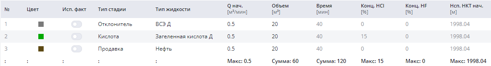
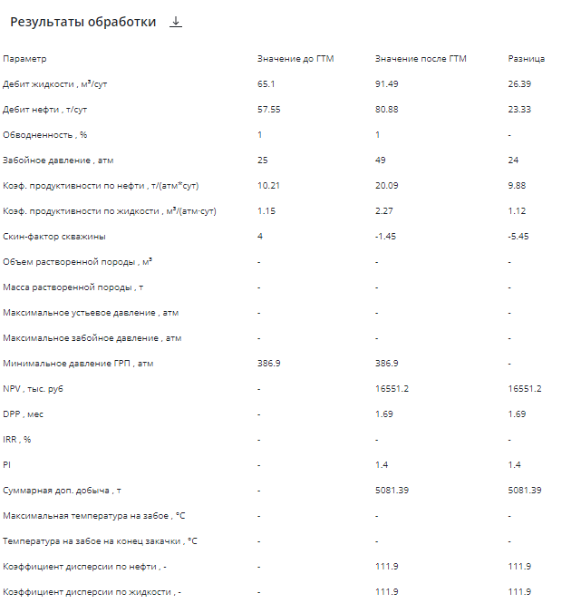

Рассмотрен пример моделирования в Симуляторе ОПЗ "RockStim" дизайна одностадийной солянокислотной обработки в горизонтальной скважине (ГС) с применением водосолевой эмульсии в качестве отклонителя и загеленным кислотным составом.

### Исходные данные

**Тип коллектора**: карбонатный

**Пластовая температура**: 37°С

**Конструкция скважины**: горизонтальная

**Тип скважины**: нефтедобывающая

**Режим обработки**: закачка с пакером

**Модель расчета**: 2D

**Используемые реагенты**: водосолевая эмульсия, загеленный кислотный состав

## Моделирование водосолевой эмульсии в качестве отклонителя

На этапе обработки входных данных было обнаружено частичное отсутствие информации по РИГИС и данных по кинетике скорости реакции кислотного состава с породой, а также неопределенность в значении скин-фактора ГС.

Проблема отсутствия данных по РИГИС была решена тем, что часть продуктивного интервала с неизвестными фильтрационно-емкостными свойствами была задана по аналогии с вышележащим пропластком.

Из базы реагентов был выбран загеленный кислотный состав, по которому имелись данные кинетики скорости реакции по эксплуатируемому объекту. Также был выбран водосолевой отклонитель, по которому имелись данные по исследованию реологии.

Задано движение ГНКТ при последовательной обработке отдельных участков.

Скин-фактор был определен с помощью блока **"Анализ добычи"** с использованием фактических режимных данных работы ВНС с момента ввода по фонду в добычу.

Согласно фактическим данным был сформирован следующий план закачки:

**Отклонитель 4м³ → Загеленный кислотный состав 20м³ → Продавка нефтью 20м³**

Для выполнения качественного моделирования ОПЗ была выбрана 2D-модель (размерность ячейки 20х20м), червоточины (высокопроницаемые фильтрационные каналы) моделировались согласно модели Гонга с максимальной детализацией выходных данных.

## Симуляция закачки отклонителя в призабойную зону скважины

По результатам моделирования отмечается проникновение отклонителя в высокопроницаемую часть продуктивного интервала, что позволят выровнять профиль проникновения кислотного состава. Это можно наблюдать по данным карт проникновения жидкостей.

**Динамика ОПЗ**

<video controls preload="metadata" class="article-video">
  <source src="/video/analiz-obrabotki-gorizontalnoj-neftedobyivayushhej-skvazhinyi.mp4" type="video/mp4" />
  Ваш браузер не поддерживает воспроизведение видео.
</video>

## Сравнение моделирования обработки водосолевой эмульсии с фактическими результатами

**Скин-фактор:** до **+4,0** / после -**1,5**

**Коэффициент продуктивности по жидкости (м³/(атм·сут):** до **10,2** / после **20,0**

**Дебит жидкости по дизайну (м³/сут):** до ОПЗ **65,1** / после ОПЗ **91,5** / факт **86,0**

**Сходимость: 94%**

**NPV** ожидаемый**: 16,551 млн.руб.**

Необходимо отметить, что после ОПЗ на скважине оптимизировали режим путем увеличения забойного давления, что также повлияло на дебит жидкости после ГТМ.

По результатам моделирования **отмечается высокая точность выполненных расчетов** по сходимости с фактическим дебитом жидкости после ОПЗ.

Узнать больше о симуляторе ОПЗ и попробовать его в действии на собственных данных можно в удобное для вас время! Запросите демонстрацию симулятора ОПЗ RockStim. Мы на связи по любому из указанных способов контактов на сайте!
