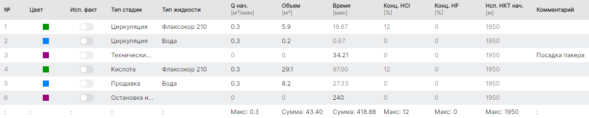
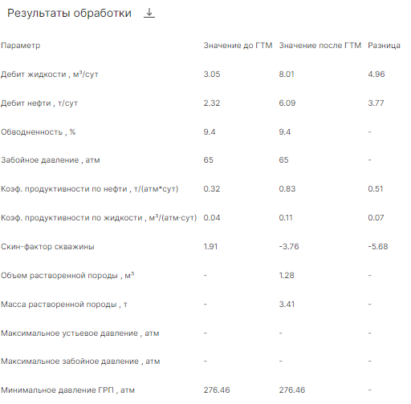

Демонстрируем пример ретроспективного моделирования дизайна одностадийной соляно-кислотной обработки с закачкой по НКТ с использованием пакера. Моделирование производится в симуляторе ОПЗ "RockStim". Получена высокая сходимость расчетного и фактического дебита по результатам математической оценки.

## Исходные данные

*Тип коллектора*: карбонатный

*Пластовая температура:* 28°С

*Конструкция скважины:* вертикальная

*Тип скважины:* нефтедобывающая

*Режим обработки:* закачка с пакером

*Модель расчета:* 1D

*Используемые реагенты:* кислота (12% HCl)

## Моделирование

Скин-фактор был определен с помощью модуля *"Анализ добычи"* с использованием фактических режимных данных работы скважины, а также с использованием результатов гидродинамических исследований перед предыдущими обработками призабойной зоны.

Из базы реагентов были выбраны кислотные составы, соответствующие кинетики скорости реакций по эксплуатируемому объекту.

Согласно фактическим данным был сформирован следующий план закачки:

*Циркуляция (кислота) 5,9 м³ → Циркуляция (вода) 0,2 м³ → Технический простой с посадкой пакера 34,21 мин→ Кислота 29,1 м³ → Продавка (вода) 8,2 м³ → Остановка на реагирование 240 мин*

*План закачки*

Для выполнения качественного моделирования ОПЗ была выбрана 1D-модель, червоточины (высокопроницаемые каналы) моделировались согласно модели Гонга с максимальной детализацией выходных данных. Данная модель была выбрана для уменьшения погрешности расчета, связанной с тем, что пласт имеет большую расчлененность.

## Симуляция закачки

По результатам моделирования отмечается проникновение кислотного состава в пласт пропорционально исходным фильтрационно-емкостным свойствам пород. Наблюдается образование червоточин на расстоянии до 5,2 м от скважины. Это можно наблюдать по данным карт проникновения жидкостей.

*Динамика ОПЗ*

[Видео](https://youtu.be/cruVHVVuOWo)

### Результаты

*Скин-фактор:* до +1,91 / после -3,76

*К-т продуктивности по жидкости (м³/(атм·сут):* до 0,32 / после 0,83

*Дебит жидкости по дизайну (м³/сут):* до 3,05 / после 8,01 / факт 7,8

*Сходимость:* 97%

По результатам моделирования **отмечается высокая точность выполненных расчетов** по сходимости с фактическим дебитом жидкости после ОПЗ.

*Результаты моделирования ОПЗ*

> Узнать больше о симуляторе ОПЗ и попробовать его в действии на собственных данных можно в удобное для вас время! Запросите демонстрацию симулятора ОПЗ RockStim. Мы на связи по любому из указанных способов контактов на сайте!
