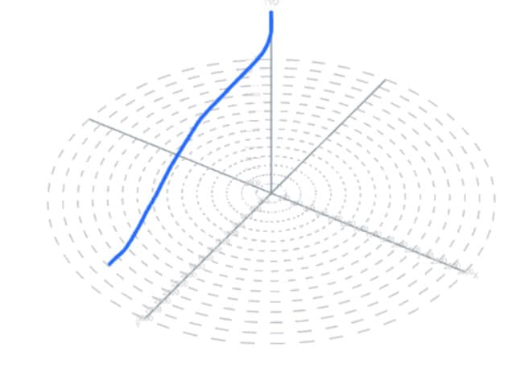
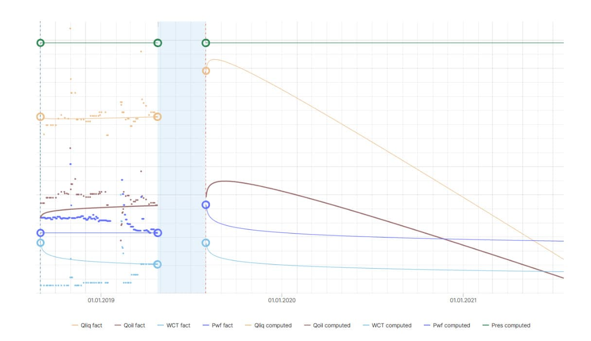
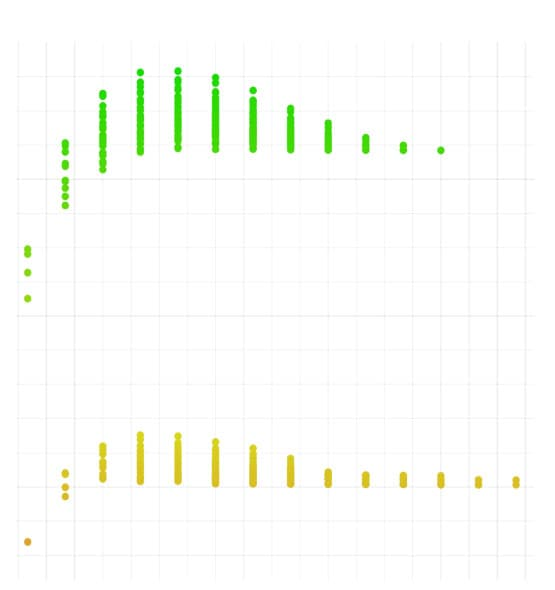
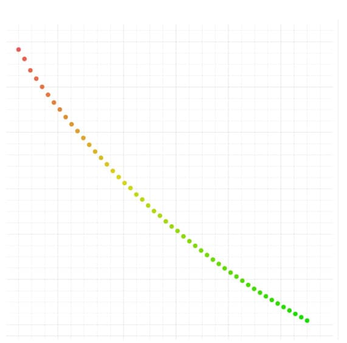
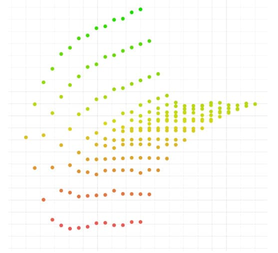
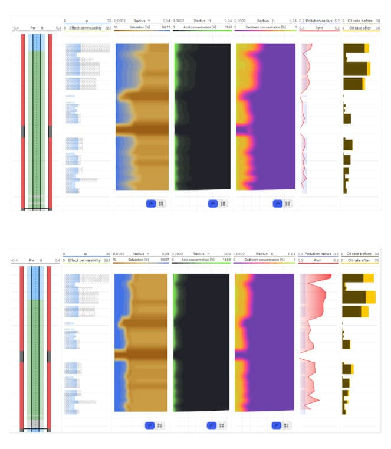
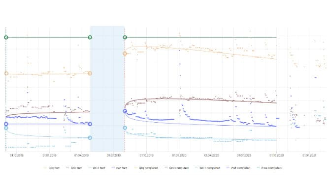

### Задача

Кислотная обработка с применением кислотного геля была выполнена без предварительного моделирования, что привело к более низкому приросту добычи и экономическому эффекту, чем ожидалось. В этом примере показан последующий анализ операции в RockStim, включая оптимизацию добычи и чистой приведенной стоимости.

- **Регион:** Северная Европа
- **Коллектор:** нефтяные карбонаты
- **Глубина:** измеренная глубина — 13,100 футов, истинная вертикальная глубина относительно уровня моря — 8956 футов
- **Заканчивание скважины:** наклонная скважина с хвостовиком

### Решение

Был задан тренд падения добычи за 5 лет, а схема обработки рассчитана на основе фактического графика кислотной обработки.

Для повышения эффективности кислотной обработки был оптимизирован график закачки. Были построены следующие зависимости:

По результатам оптимизации были предложены следующие корректировки:

- Сократить количество стадий кислоты и кислотного геля
- Уменьшить объем кислоты до 15,840 галлонов в две стадии (7,920 галлонов + 7,920 галлонов)
- Закачивать кислотный гель до кислоты, а не после нее
- Увеличить объем кислотного геля до 15,840 галлонов в две стадии (13,200 галлонов + 2,640 галлонов)

### Результаты

Оптимизация в RockStim улучшила охват кислотной обработкой, увеличила добычу нефти и чистую приведенную стоимость.

| Параметр                                            | Факт, без оптимизации | Оптимальный дизайн |
| --------------------------------------------------- | --------------------- | ------------------ |
| Дебит нефти, барр./сут                              | 815                   | 996                |
| Скин-фактор                                         | -1.1                  | -2.1               |
| Чистая приведенная стоимость, тыс. долл. США        | 354                   | 1532               |
| Дополнительная добыча нефти за 14 месяцев, тыс. барр. | 31                  | 114                |
| Максимальная глубина червоточины, футы              | 2.7                   | 7.0                |

Оптимизированный вариант обработки был откалиброван по фактическому тренду падения добычи после стимуляции.

| Параметр                                            | Факт, без оптимизации | Оптимальный дизайн |
| --------------------------------------------------- | --------------------- | ------------------ |
| Чистая приведенная стоимость, тыс. долл. США        | 978                   | 2335               |
| Дополнительная добыча нефти за 14 месяцев, тыс. барр. | 73                  | 170                |
