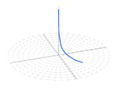
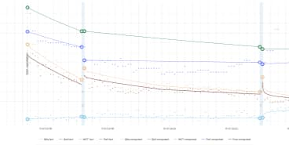
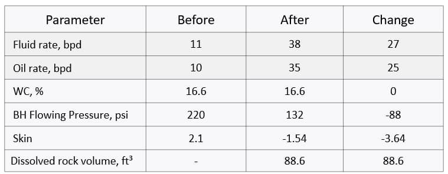
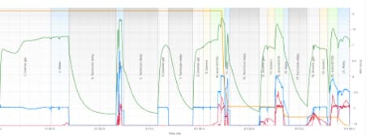
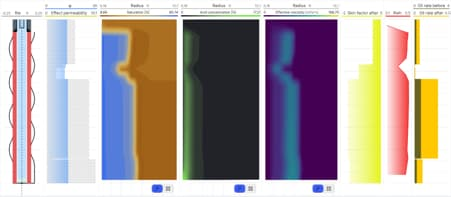
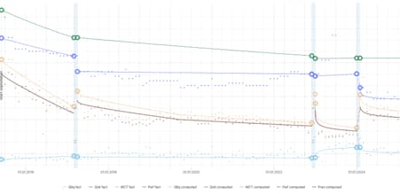
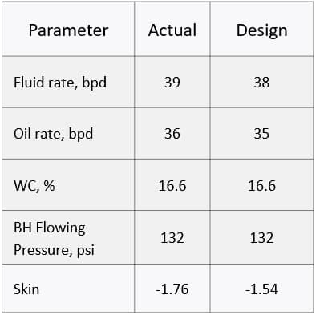

### Задача

Кислотная обработка методом прямой закачки с отклонителем, закачанным через затрубное пространство, была выполнена по проекту **RockStim**. Результаты добычи после стимуляции показали **97.7% совпадения** с расчетными значениями.

- **Регион:** Центральная Азия
- **Коллектор:** нефтяные карбонаты
- **Глубина:** измеренная глубина — 4,400 футов, истинная вертикальная глубина относительно уровня моря — 2,500 футов
- **Заканчивание скважины:** горизонтальный открытый ствол
- **Длина горизонтального участка:** 440 футов
- **Обсадная колонна:** 4.5" на глубине 4,000 футов
- **НКТ:** 2.5" на глубине 3,900 футов

### Решение

Была выполнена адаптация истории добычи за последние 8.5 лет. Ключевые параметры, включая дебит жидкости, дебит нефти, обводненность, поровое давление и забойное давление на режиме, были согласованы с предыдущими обработками скважины. Изменение скин-фактора оценивалось до и после каждой исторической стимуляции. **Текущий скин-фактор** был оценен как **2.1**.

Кислотная обработка была выполнена по проекту RockStim. Последующий анализ фактических данных обработки показал высокое совпадение расчетных и фактических параметров.

### Результаты

Фактические данные добычи были загружены в RockStim через несколько месяцев после обработки. Модуль аналитики добычи RockStim оценил совпадение расчетных и фактических параметров.

**Совпадение расчетной и фактической добычи нефти составило 97.7%.**

Возможность откалибровать модель по геологическим и механическим характеристикам коллектора с использованием результатов лабораторных исследований и точного анализа исторических данных добычи, включая оценку текущего скин-фактора, обеспечивает высокую степень совпадения прогнозных и фактических параметров после кислотной обработки.
