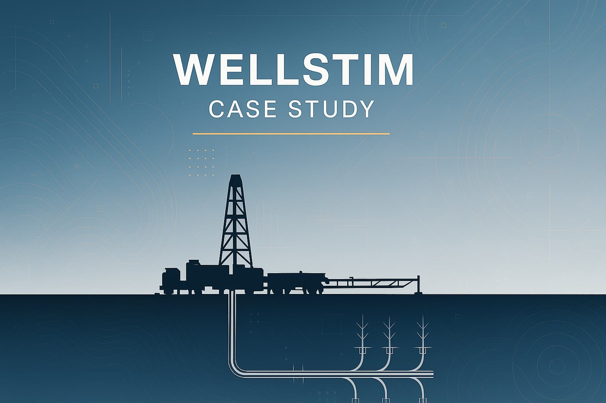
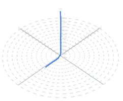
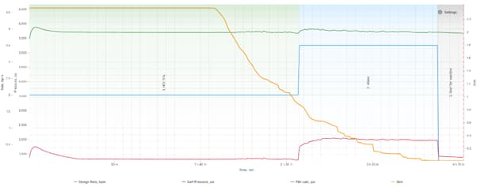
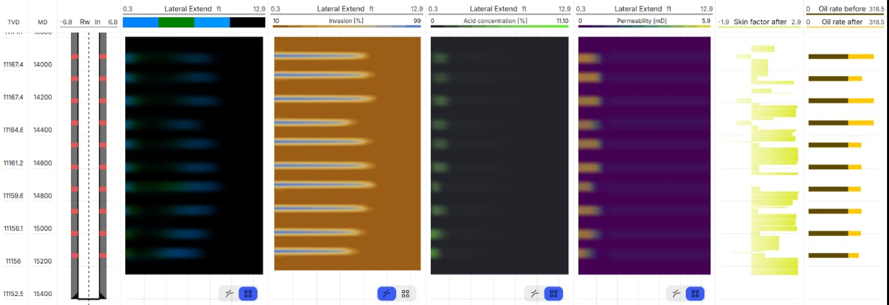
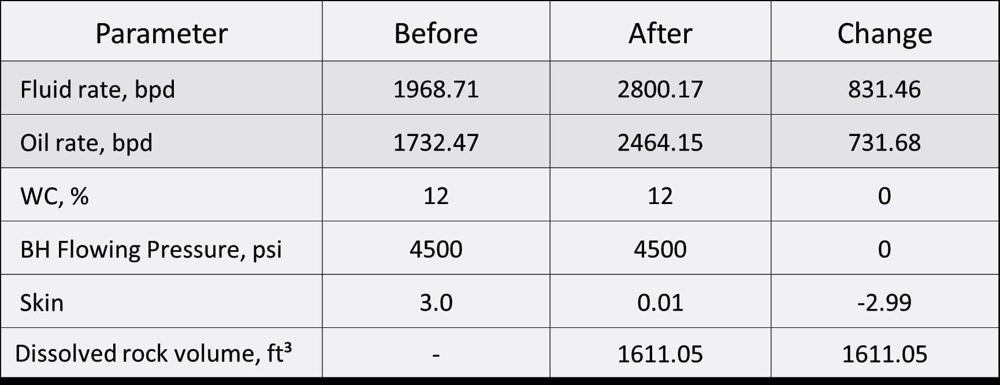

import { Columns } from "@/components/columns/index.js";

### The challenge

The **radial drilling completion** was designed to enhance inflow performance and reduce the high skin values previously identified in the producing interval.

<Columns center>
  

    - **Area:** Central Asia - **Reservoir:** Oil sandstone - **Depth:** MD –
    19,482.61 ft, TVDSS – 18,819.52 ft - **Initial Skin:** +2.83 -
    **Objective:** Improve inflow performance and evaluate skin reduction
    through radial channel drilling
  

  

    
  

</Columns>

### The solution

A retrospective analysis of the well's production regime determined the **initial skin factor as +2.83**.
Using **WellStim**, a model of the main wellbore and three radial channels was created to simulate the **geometry** and **hydraulic behavior** of the stimulation system.

#### Parameters of Radial Channel Trajectories

| Parameter                             | Channel 1 | Channel 2 | Channel 3 |
| ------------------------------------- | --------- | --------- | --------- |
| Measured depth of exit point (ft)     | 5741.47   | 5741.47   | 5721.78   |
| Borehole length (ft)                  | 45.93     | 45.93     | 45.93     |
| Exit angle from borehole (zenith, °)  | 0.07      | 0.07      | 0.05      |
| Exit angle from borehole (azimuth, °) | 52.60     | 52.60     | 196.44    |
| Angle build-up (zenith, °)            | 88.20     | 88.10     | 88.12     |
| Angle build-up (azimuth, °)           | 0.00      | 120.00    | -120.00   |
| Channel diameter (ft)                 | 0.23      | 0.23      | 0.23      |

The **main wellbore trajectory** and **reservoir petrophysical model** served as inputs for the simulation of **radial trajectories** and subsequent **inflow performance evaluation**.

### The results

Following the drilling and completion of three radial channels, **inflow performance improved substantially**.
The **skin factor decreased from +2.83 to -3.11**, confirming efficient removal of near-wellbore damage and improved reservoir connectivity.

| Parameter        | Before Radial Perforation | After Radial Perforation |
| ---------------- | ------------------------- | ------------------------ |
| Fluid rate (bpd) | 94.35                     | 214.04                   |
| Oil rate (bpd)   | 13.21                     | 29.97                    |
| Skin             | +2.83                     | -3.11                    |

**Key achievements:**

- **127% increase** in fluid production rate
- **127% increase** in oil production rate
- **Complete skin removal** and negative skin achieved (from +2.83 to -3.11)
- **Three radial channels** successfully drilled and completed
- **Improved reservoir connectivity** and near-wellbore flow conditions

### Summary

This case demonstrates **WellStim's capability** to:

- Design and simulate **radial drilling trajectories** with precision
- Model **inflow and skin performance** before and after completion
- Quantitatively evaluate **productivity improvements** achieved by radial stimulation

The **radial drilling operation** led to substantial production gains while effectively creating new drainage pathways in the sandstone reservoir, confirming the effectiveness of **WellStim's radial drilling design and simulation workflow** for optimizing productivity.
