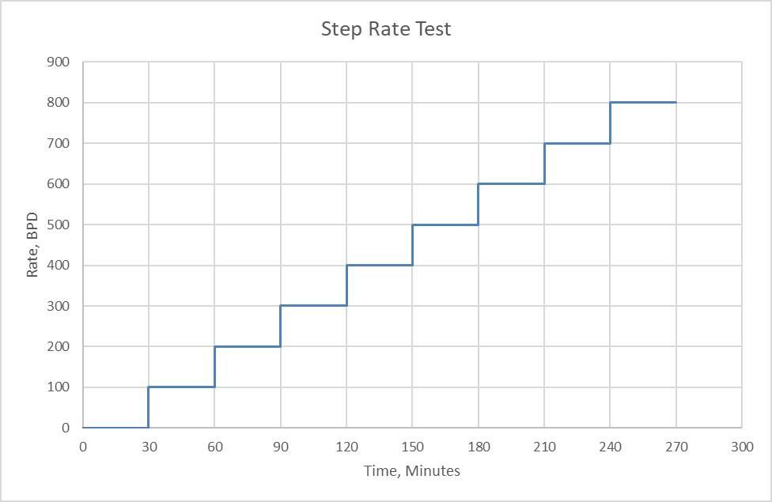
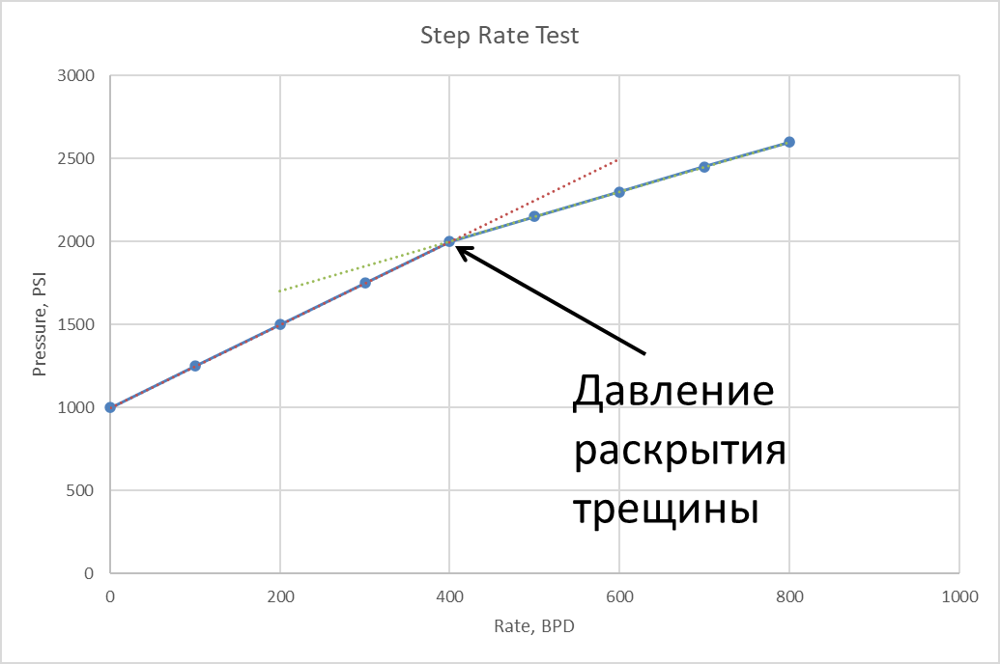
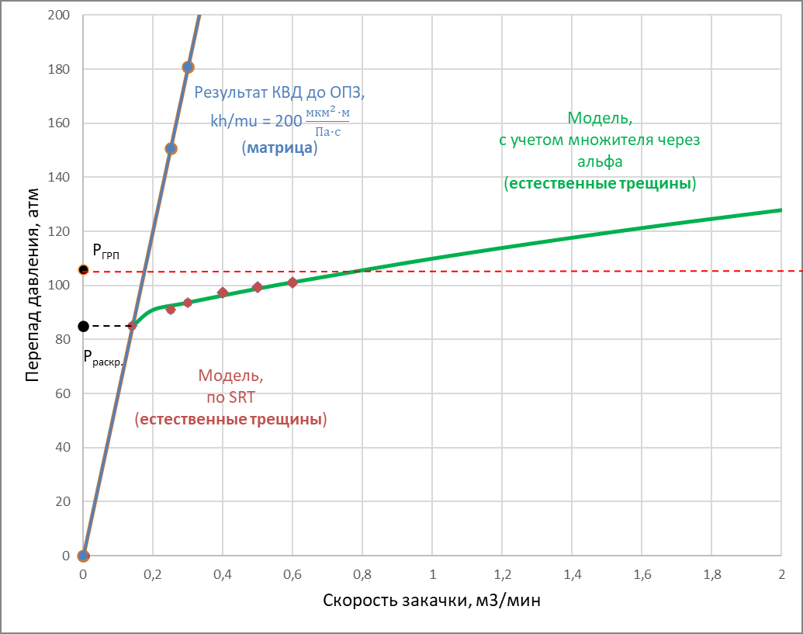
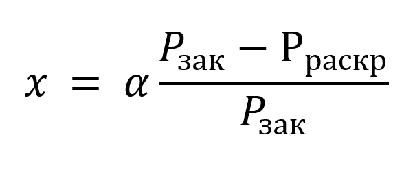
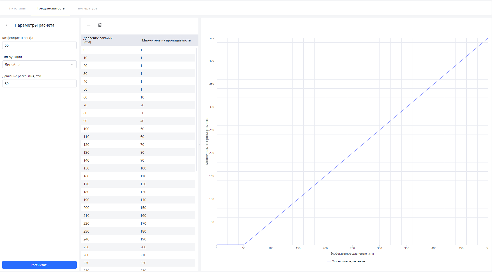

## Step Rate Test

**Ступенчатый тест на приемистость (SRT, Step rate test, тест со ступенчатым повышением расхода)** – один из методов гидродинамических исследований скважин, используемый для определения значения давления раскрытия естественных трещин и коэффициента ***α***.

Коэффициент **α** учитывает изменение проницаемости при нагнетании различных жидкостей в пласт.

В рамках выполнения SRT проводится серия равномерных изменений скорости закачки жидкости в скважину с равными временными промежутками между ними.

*Изменение скорости закачки при проведении SRT*

В процессе проведения теста происходит запись значений забойного и устьевого давления, расхода нагнетаемой жидкости, а также температур на устье и забое скважины.

В определенный момент времени, когда происходит раскрытие трещины, наблюдается изменение характера кривой зависимости забойного давления от скорости закачки.

*Зависимость забойного давления от скорости закачки*

Давление, при котором наблюдается излом, соответсвует давлению раскрытия естественной трещины, при котором происходит изменение проницаемости, учитываемое коэффициентом ***α***.

Коэффициент **α** подбирается таким образом, чтобы индикаторная диаграмма совпадала с фактическими значениями, полученными при проведении ступенчатого теста на приемистость

*Результат подбора коэффициента α*

## Использование результатов ступенчатого теста в симуляторе ОПЗ "RockStim"

В процессе закачки различных реагентов размер трещины может меняться, что влияет на проницаемость обрабатываемого интервала. Для учета этого явления используется коэффициент, учитывающий изменение проницаемости от давления закачки, который называется «‎множитель на проницаемость».

«Множитель на проницаемость» рассчитывается по следующей формуле:

где ***α*** - коэффициент, учитывающий раскрытие естественных трещин, определяемый по результатам интерпретации STEP-RATE теста;

***Рзак*** - забойное давление закачки, атм;

***Рраскр*** - давление раскрытия естественных трещин, определяемый по результатам интерпретации STEP-RATE теста, атм.

По полученным рассчитанным значениям «Множителя на проницаемость» и давления раскрытия естественных трещин строится графическая зависимость, которая используется в дальнейшем при проектировании дизайна обработки.

*Зависимость «Множителя на проницаемость» и давления раскрытия естественных трещин*

Необходимо помнить, что ***α*** в реестре литотипов задается на выбранный объект эксплуатации. Для того, чтобы учесть особенности свойств призабойной зоны скважины, для которой проектируется дизайн, необходимо воспользоваться α в выборе расчетной модели во вкладке «Результаты».

Узнать больше о симуляторе ОПЗ и попробовать его в действии на собственных данных можно в удобное для вас время! Запросите демонстрацию симулятора ОПЗ RockStim. Мы на связи по любому из указанных способов контактов на сайте!
