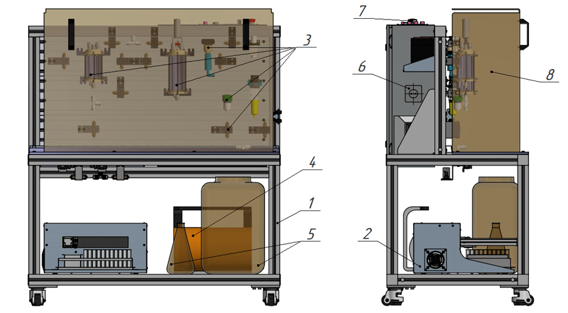

Соляно-кислотная обработка является одним из наиболее распространенных и эффективных методов воздействия на призабойную зону карбонатного пласта. В качестве основного процесса обработки скважин можно отметить растворение минералов горной породы и кольматантов за счет физико-химического воздействия кислоты. Это ведет к увеличению коэффициентов продуктивности добывающих и приемистости нагнетательных скважин путем увеличения размеров и очистки поровых каналов горных пород, в частности путем протравливания новых высокопроницаемых каналов - червоточин.

Одним из основных факторов, определяющим эффективность соляно-кислотной обработки, является глубина проникновения воздействующего агента в толщу продуктивного пласта, которая в свою очередь зависит от степени реакционной активности кислотного состава.

Для достижения наилучшего результата воздействия важно обеспечивать продвижение реакционной способности кислоты в наиболее удаленную от скважины зону. В противном случае, если наибольшая нейтрализация рабочего агента произойдет вблизи скважины, то могут произойти осложнения в виде растворения цементного камня с последующим риском возникновения заколонной циркуляции.

Основными параметрами, определяющими эффективность кислотной обработки, являются:

- коэффициент диффузии De;
- константа скорости реакции k;
- порядок реакции n.

Одним из условий успешного проведения обработки призабойной зоны пласта является изучение кинетики взаимодействия кислоты с образцами горной породы. Для этого используется, в частности, установка с вращающим диском.

С помощью изменения скорости вращения оцилиндрованного кернового материала в реакторе можно имитировать различные скорости закачки кислоты и тем самым исследовать разные режимы протекания реакции.

**Схема установки с вращающимся диском**

1 – стойка изделия с установленными на ней гидравлическими, пневматическими элементами; 2 – прибор сбора проб; 3 – элементы гидравлической обвязки изделия; 4 – компрессор воздушный; 5 – контейнеры сливные; 6 – электрический шкаф изделия; 7 – органы управления изделием, разъемы подключения потребителей; 8 – экран защитный.

Физический смысл состоит в определении скорости протекания реакции. Происходит периодический отбор проб кислоты с последующим определением концентрации кальция и магния путем титрования, значения которых используются для определения необходимых кинетических параметров.

Полученные значения и зависимости используются в процессе моделирования кислотных обработок для прогнозирования эффективности и выбора оптимальных параметров воздействия на пласт. Это происходит за счет внесения данных в базу реагентов RockStim.
