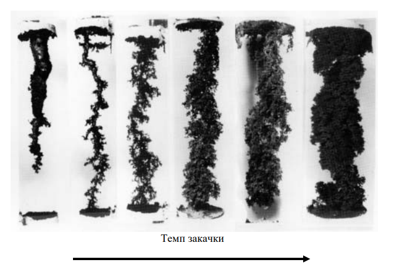
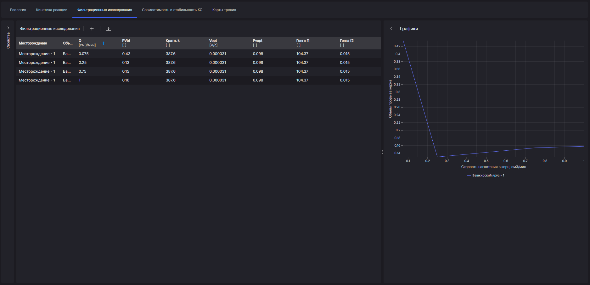

Для определения фильтруемости реагентов различного типа и выявления характера взаимодействия их с породой проводят комплекс лабораторных исследований на керновом материале с последующей статистической обработкой результатов. Такие лабораторные исследования называются фильтрационными и проводятся на специализированных установках.

Напомним, что основной целью кислотной обработки является повышение продуктивности (снижение скин-фактора) скважины путем растворения породы коллектора и образования новых высокопроницаемых каналов в призабойной зоне. По причине неравномерного продвижения фронта растворения, в известняке могут образовываться крупные каналы (червоточины).

Для применения в комплексном инженерном инструменте проектирования обработок "RockStim" предпочтение было отдано математическим полуэмпирическим моделям Гонга и Паларини, определяющих эволюцию фронта распространения кислотных червоточин в процессе закачки и позволяющим настроить модель под конкретные геологические условия. В то время как известные зарубежные симуляторы основываются только на математических моделях, с заранее проставленными и скрытыми от инженера параметрами, которые не отвечают геологическим условиям.

Для адаптации модели обработки проводятся фильтрационные исследования с различными кислотными составами, имеющими различную исходную концентрацию соляной кислоты и добавками, регулирующими скорость реакции.

В соответствии с методикой, необходимой для адаптации полуэмпирических моделей, представленной их авторами, для каждого кислотного состава должно быть проведено как минимум 4 фильтрационных теста при различных скоростях закачки кислотной композиции с целью определения оптимальной скорости нагнетания в керн, при которой достигается минимальное значение количество поровых объемов закачки до прорыва керна червоточиной: от 0,01 до 1,5 мл/мин.

Полученные значения и зависимости используются в процессе моделирования кислотных обработок для прогнозирования эффективности и выбора оптимальных параметров воздействия на пласт. Это происходит за счет внесения данных в базу реагентов RockStim.

