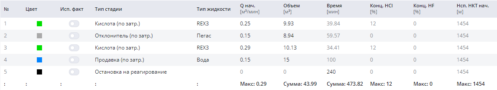
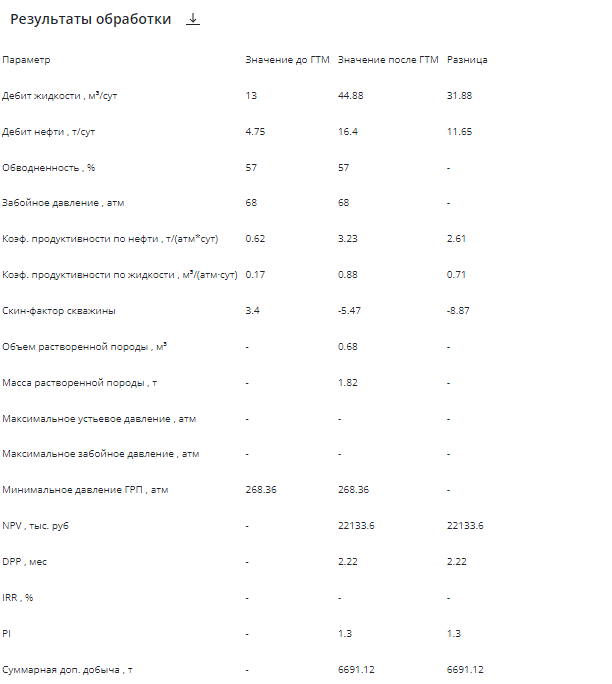

Рассматривается пример ретроспективного моделирования в Симуляторе ОПЗ "RockStim" дизайна двухстадийной солянокислотной обработки, с закачкой по затрубному пространству с применением отклонителя, в карбонатном пласте

### Исходные данные

**Тип коллектора:** карбонатный

**Пластовая температура:** 25°С

**Конструкция скважины:** вертикальная

**Тип скважины:** нефтедобывающая

**Режим обработки:** закачка без пакера

**Модель расчета:** 1D

**Используемые реагенты:** кислота, отклонитель

## Моделирование кислотной обработки

Скин-фактор был определен с помощью блока **"Анализ добычи"** с использованием фактических режимных данных работы скважины.

Из базы реагентов были выбраны кислотные составы, по которым имелись данные кинетики по эксплуатируемому объекту.

Согласно фактическим данным был сформирован следующий план закачки:

**Кислота (по затрубному пространству) 9,93м³ → Отклонитель (по затр.) 8,94м³ → Кислота (по затр.) 10,13м³ → Продавка (по затр.) 15м³**

Для выполнения качественного моделирования ОПЗ была выбрана 1D-модель, червоточины моделировались согласно модели Гонга с максимальной детализацией выходных данных. Данная модель была выбрана для уменьшения погрешности расчета, связанной с тем, что пласт имеет большую расчлененность.

## Симуляция закачки кислоты в пласт

По результатам моделирования отмечается частичное проникновение отклонителя в высокопроницаемую часть продуктивного интервала, что позволят в какой-то степени выровнять профиль проникновения кислотного состава. Это можно наблюдать по данным карт проникновения жидкостей.

**Динамика ОПЗ**

<video controls preload="metadata" class="article-video">
  <source src="/video/retrospektivnyij-analiz-dvuxstadijnoj-solyanokislotnoj-obrabotki-s-primeneniem-otklonitelya.mp4" type="video/mp4" />
  Ваш браузер не поддерживает воспроизведение видео.
</video>

## Сравнение результатов прогноза ГТМ и фактических результатов

**Скин-фактор:** до **+4,6** / после **-5,47**

**Коэффициент продуктивности по жидкости (м³/(атм·сут):** до **0,15** / после **0,88**

**Дебит жидкости по дизайну (м³/сут):** до **13** / после **44,88** / факт **47,16**

**Сходимость:** **95%**

**NPV - чисто дисконтированный доход** ожидаемый: **22,1 млн.руб.**

По результатам моделирования **отмечается высокая сходимость** с фактическим дебитом жидкости после ОПЗ.

Узнать больше о симуляторе ОПЗ и попробовать его в действии на собственных данных можно в удобное для вас время! Запросите демонстрацию симулятора ОПЗ RockStim. Мы на связи по любому из указанных способов контактов на сайте!
